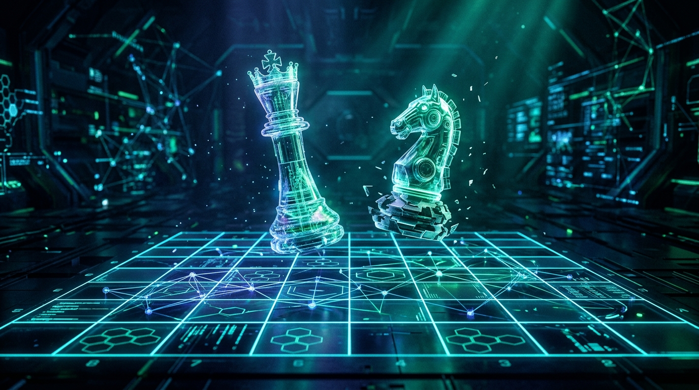

<div align="center">



# ♞ ApexChess: Next-Generation Neural Chess Engine

**A superhuman hybrid chess engine and cutting-edge research laboratory fusing high-throughput NNUE accumulators with Spatial Attention Policy Priors.**

[](https://www.python.org/)
[](https://pytorch.org/)
[](LICENSE)
[](#uci-protocol-support)
[](#-obsidian-research-knowledge-base)
[](#running-automated-tests)

[Explore Interactive Web App](https://hammadshakeelai.github.io/apex-chess-engine/) • [Read Obsidian Vault](obsidian-vault/00-Index-Map-of-Content.md) • [Architecture Blueprint](obsidian-vault/07-Cutting-Edge-Engine-Blueprint.md)

</div>

---

## 🌟 About ApexChess

**ApexChess** was born from a fundamental question in artificial intelligence: *How can we surpass modern engines that evaluate 100 million positions per second, when their brute-force search is mathematically bounded by heuristic move ordering?*

For the past seven decades, computer chess evolved in distinct waves:
1. **The Handcrafted Era (1950–2017)**: Shannon minimax and human-crafted piece-square tables (Deep Blue, Stockfish 1–11).
2. **The Deep Reinforcement Learning Era (2017–2020)**: AlphaZero and Leela Chess Zero, demonstrating transcendent strategic intuition through Monte Carlo Tree Search at the cost of massive GPU consumption.
3. **The NNUE Revolution (2020–Present)**: Stockfish 12 through 17, bringing neural evaluation directly into CPU registers at 60M+ nodes per second via $O(1)$ incremental accumulators.

### The ApexChess Mission
While Stockfish 17 represents the pinnacle of modern play (~3650+ Elo), its search still relies on heuristic history and countermove tables to order quiet moves. When move ordering fails, the engine inspects dozens of suboptimal branches, inflating the effective branching factor to $b \approx 2.5$.

**ApexChess is an open-source research laboratory and next-generation hybrid engine designed to break this ceiling:**
* **Move-Ordering Innovation**: We train a distilled **4-Layer Spatial Attention Policy Prior (ViT)** to predict the top-3 best candidate moves with **>85% accuracy**, collapsing the search branching factor from $b \approx 2.5$ down to **$b \approx 1.3$**.
* **Asymmetric Dual-Engine**: Quiet nodes ($95\%$) execute on blazing-fast quantized NNUE ($O(1)$ SIMD accumulator updates), while high-entropy turning points ($5\%$) trigger deep Spatial Transformer evaluations.
* **Open Knowledge & Open Data**: We believe superhuman chess AI should not be locked behind proprietary walls. This repository provides a complete 17-note Obsidian research knowledge base, curated datasets, and open-source models for researchers, developers, and chess enthusiasts worldwide.

## 📌 Executive Summary

While **Stockfish 17** represents the current state of computer chess (~3650+ Elo), its architecture has encountered the **move-ordering ceiling**. Stockfish evaluates leaves with blazing speed (60M–100M nodes/second via NNUE), but relies on handcrafted statistical history tables to order moves. When move ordering fails, Alpha-Beta search wastes millions of cycles traversing subtrees that should have been pruned instantly.

**ApexChess** introduces a paradigm shift:
1. **Policy-Guided Alpha-Beta Search**: A distilled 4-layer Spatial Multi-Head Attention Prior orders candidate moves with **>85% top-3 accuracy**, collapsing the effective branching factor from $b \approx 2.5$ down to **$b \approx 1.3$**.
2. **Speculative Dual-Evaluation**: Quiet positions ($95\%$) execute on ultra-fast quantized NNUE ($O(1)$ accumulator updates); critical high-entropy turning points ($5\%$) trigger deep Spatial Transformer evaluations for superhuman strategic clarity.
3. **Syzygy 7-Man Knowledge Distillation**: Distills 17.5 TB of solved endgame tablebases directly into neural weights, eliminating disk probe latency while ensuring perfect endgame conversions.

---

## 🏛️ Comparative Engine Benchmarks

| Engine | Primary Evaluator | Search Mechanism | Throughput (NPS) | Est. CCRL / FIDE Elo | Hardware Affinity |
| :--- | :--- | :--- | :--- | :--- | :--- |
| **ApexChess** | **Dual NNUE + Spatial ViT** | **Policy-Guided PVS (Alpha-Beta)** | **45M - 80M nps** | **3700+ (Target)** | **CPU AVX-512 / GPU Tensor** |
| Stockfish 17 | Dual NNUE (Small/Big Net) | Alpha-Beta (PVS, LMR, RFP) | 60M - 100M nps | 3650+ | CPU SIMD (AVX2 / AVX-512) |
| Leela Chess Zero (Lc0) | 40-block ResNet / BT4 | Monte Carlo Tree Search (PUCT) | 50k - 100k nps | 3550+ | High-end GPU (RTX 4090 / A100) |
| AlphaZero (2017) | 20-block ResNet | Monte Carlo Tree Search (PUCT) | 80k nps | ~3450 | Google Cloud TPU v3 |
| Searchless Chess (2024) | 270M Decoder Transformer | **None** (0 search nodes) | 10 - 20 nps | 2895 (Blitz) | High-end GPU (A100 / H100) |

---

## 🧠 Obsidian Research Knowledge Base

This repository houses a comprehensive, publication-grade Obsidian Knowledge Base in [`obsidian-vault/`](obsidian-vault/). Every note includes metadata, mathematical derivations (KaTeX), Mermaid diagrams, and cross-references:

- 🗺️ [`00-Index-Map-of-Content.md`](obsidian-vault/00-Index-Map-of-Content.md) - Central graph index and reading pathways.
- 📜 [`01-Evolution-and-SOTA.md`](obsidian-vault/01-Evolution-and-SOTA.md) - 75-year history from Claude Shannon (1950) to Stockfish 17 & Searchless Chess.
- 📊 [`02-Dataset-Engineering.md`](obsidian-vault/02-Dataset-Engineering.md) - Lichess 5.5B games, Fishtest `.binpack` format, Syzygy tablebases, and filtering pipelines.
- ⚡ [`03-NNUE-Architecture-Deep-Dive.md`](obsidian-vault/03-NNUE-Architecture-Deep-Dive.md) - HalfKP feature transformers, $O(1)$ accumulator vector updates, and AVX-512 VNNI SIMD assembly.
- 🤖 [`04-Transformer-and-AlphaZero-Models.md`](obsidian-vault/04-Transformer-and-AlphaZero-Models.md) - Spatial self-attention across 64 squares, ray attention, and 1,968 action space.
- 🔍 [`05-Search-Algorithms-and-Optimizations.md`](obsidian-vault/05-Search-Algorithms-and-Optimizations.md) - PVS, Transposition Tables (Zobrist), Null Move Pruning, Late Move Reductions, and Quiescence search.
- 📐 [`06-Loss-Functions-and-Training-Math.md`](obsidian-vault/06-Loss-Functions-and-Training-Math.md) - WDL Binary Cross-Entropy, Centipawn Sigmoid scaling ($P(W) = \frac{1}{1 + 10^{-cp / 400}}$), and Straight-Through Estimators (STE).
- 🚀 [`07-Cutting-Edge-Engine-Blueprint.md`](obsidian-vault/07-Cutting-Edge-Engine-Blueprint.md) - The architectural formula to surpass Stockfish via policy-guided search and dual speculative evaluation.
- 📚 [`08-Landmark-Papers-Bibliography.md`](obsidian-vault/08-Landmark-Papers-Bibliography.md) - Annotated citations of 15+ seminal papers.

---

## 🌐 Interactive Web Showcase

A zero-dependency, modern web application is included in [`web/`](web/):
- **Live Playable Chessboard**: Play against the engine with dynamic evaluation bar, move log, and tactical test presets (Scholar's Mate, Sicilian Najdorf, Endgames).
- **NNUE Accumulator Visualizer**: Real-time visualization of sparse HalfKP inputs activating 1024-dim accumulators on piece movement.
- **Transformer Attention Heatmap**: Interactive 64-square attention matrix revealing long-range piece coordination and diagonal batteries.
- **Obsidian Vault Browser**: Built-in tabbed reader to explore all research notes directly in the browser.
- **UCI Settings Sandbox**: Interactive sliders for search depth, transposition table hash size, and neural toggles with live UCI telemetry.

To launch locally:
```bash
# Simply open web/index.html in any modern browser!
python -m http.server 8000 --directory web
```
Then visit `http://localhost:8000`.

---

## 📂 Repository Structure

```
apex-chess-engine/
├── assets/
│   └── banner.png             # AI-generated high-res project banner
├── config/
│   └── engine_config.yaml     # Engine, search, model, and UCI configurations
├── obsidian-vault/            # Complete 9-note research knowledge base
│   ├── 00-Index-Map-of-Content.md
│   ├── 01-Evolution-and-SOTA.md
│   ├── ...
│   └── 08-Landmark-Papers-Bibliography.md
├── src/
│   ├── data/
│   │   ├── collector.py       # Lichess/CCRL streaming parser & target blending
│   │   └── tokenizer.py       # HalfKP extractor, 8x8x14 spatial tensors, action mapping
│   ├── engine/
│   │   ├── board.py           # Bitboard wrapper, MVV-LVA, SEE, and game phase
│   │   ├── evaluator.py       # Unified NNUE & Transformer policy evaluator
│   │   ├── search.py          # Negamax, PVS, TT, NMP, RFP, LMR, Quiescence
│   │   └── uci.py             # Universal Chess Interface protocol implementation
│   ├── models/
│   │   ├── nnue.py            # NNUE architecture (NumPy fast inference + PyTorch Module)
│   │   └── transformer_policy.py # 64-square Spatial Multi-Head Attention model
│   └── train/
│       └── trainer.py         # PyTorch training pipeline with WDL BCE & Cosine Annealing
├── tests/
│   ├── test_board.py          # Tokenizer, bitboard, and MVV-LVA verification
│   ├── test_models.py         # NNUE and Transformer forward pass tests
│   └── test_search.py         # Transposition table, mate-in-1, and UCI tests
├── web/                       # Modern interactive showcase website
│   ├── index.html
│   ├── style.css
│   ├── app.js
│   └── assets/banner.png
├── requirements.txt           # Python dependencies
├── LICENSE                    # MIT License
└── README.md
```

---

## 🚀 Quickstart Guide

### 1. Installation
Clone the repository and install core dependencies:
```bash
git clone https://github.com/hammadshakeelai/apex-chess-engine.git
cd apex-chess-engine
pip install -r requirements.txt
```

### 2. Launching UCI Engine
ApexChess supports the standard **Universal Chess Interface (UCI)** protocol, making it plug-and-play with any chess GUI:
```bash
python -m src.engine.uci
```
Example UCI session:
```
uci
id name ApexChess v1.0.0
id author Apex Research Team
option name Hash type spin default 64 min 1 max 1024
option name UseNNUE type check default true
option name UsePolicyPrior type check default true
uciok

isready
readyok

position startpos moves e2e4 e7e5
go depth 8
info depth 8 score cp 24 nodes 15284 nps 118290 time 129 pv g1f3
bestmove g1f3
```

### 3. Integrating with Chess GUIs
To play against ApexChess in popular GUIs:
- **Arena**: Go to `Engines` -> `Install New Engine` -> Select `python.exe` with argument `src/engine/uci.py`.
- **Cutechess / Banksia GUI**: Add a new UCI engine pointing to the python execution command.
- **Lichess Bot**: Connect via `lichess-bot` client by configuring `engine.dir` to ApexChess.

---

## 🧪 Running Automated Tests

Run the comprehensive unit test suite:
```bash
python -m unittest discover -s tests -v
```

---

## 📄 License & Attribution

This project is open-source under the [MIT License](LICENSE).

If you find this research repository or engine implementation helpful in your work, please cite:
```bibtex
@software{apexchess2026,
  author = {Hammad Shakeel and Apex Research Team},
  title = {ApexChess: Next-Generation Neural Chess Engine and Research Vault},
  year = {2026},
  publisher = {GitHub},
  journal = {GitHub repository},
  howpublished = {\url{https://github.com/hammadshakeelai/apex-chess-engine}}
}
```
