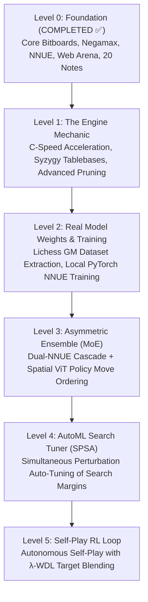

# 🗺️ ApexChess Master Roadmap & Architecture Guide

Welcome to the **ApexChess Engineering Blueprint**. This document serves two vital purposes:
1. **Get to Know the Whole Project**: A transparent breakdown of the entire codebase, what every file does, and how data and evaluations flow through the system.
2. **The Realistic Level-by-Level Roadmap**: A battle-tested path from our current foundation to a superhuman hybrid chess engine, tailored specifically to our real-world hardware and computational limitations.

---

## 🧭 Part 1: How ApexChess Works (The System Architecture)

Understanding ApexChess requires seeing how a single position flows from a user input to a calculated move.

```
                    [ FEN Position / Move Input ]
                                  │
                   ┌──────────────┴──────────────┐
                   ▼                             ▼
       [ src/data/tokenizer.py ]      [ src/engine/board.py ]
       Extracts HalfKP Indices        Bitboards, Legal Moves, MVV-LVA,
       & Spatial 8x8x14 Tensors       Game Phase & Static Exchange (SEE)
                   │                             │
                   └──────────────┬──────────────┘
                                  ▼
                     [ src/engine/search.py ]
                     Negamax + PVS + Alpha-Beta Pruning
                     Transposition Table (Zobrist 64-bit)
                     Aspiration Windows + Quiescence Search
                                  │
                   ┌──────────────┴──────────────┐
                   ▼                             ▼
       [ src/models/nnue.py ]       [ src/models/transformer_policy.py ]
       HalfKP Sparse Accumulator    Spatial Multi-Head Attention (ViT)
       O(1) Leaf Evaluation         Move-Ordering Prior (Top 3 Candidates)
                   │                             │
                   └──────────────┬──────────────┘
                                  ▼
                     [ src/engine/evaluator.py ]
                     Blended Strategic / Tactical Score
                                  │
                                  ▼
                   ┌─────────────────────────────┐
                   │    Output / User Action     │
                   ├──────────────┬──────────────┤
                   ▼                             ▼
         [ src/engine/uci.py ]       [ web/app.js & GitHub Pages ]
         UCI Protocol for GUIs       Live Chess.com UI Arena
         (Arena, Cutechess, Banksia) (Stockfish, Lc0, AlphaZero, Maia)
```

---

### 📂 Directory & File Catalog

| Directory / File | Role & Responsibility | Key Technologies |
| :--- | :--- | :--- |
| **`src/engine/board.py`** | Bitboard abstractions, legal move validation, MVV-LVA move ordering, Static Exchange Evaluation (SEE), and game-phase calculation. | `python-chess`, NumPy |
| **`src/engine/search.py`** | The search brain: Negamax with Alpha-Beta pruning, Principal Variation Search (PVS), Aspiration Windows, Zobrist Transposition Table, Quiescence, Null Move Pruning (NMP), Late Move Reductions (LMR). | Python, Zobrist Hashing |
| **`src/engine/evaluator.py`** | Bridges neural evaluation and search. Selectively calls NNUE and piece-square heuristics. | NumPy, PyTorch |
| **`src/engine/uci.py`** | The Universal Chess Interface (UCI) protocol listener. Connects ApexChess to standard GUIs (Arena, Cutechess, Banksia, Lichess bot). | Standard I/O, UCI Protocol |
| **`src/models/nnue.py`** | Dual-NNUE HalfKP accumulator ($40,960 \rightarrow 256 \times 2 \rightarrow 1$) with SCReLU activations. Provides pure NumPy inference + PyTorch Module. | NumPy, PyTorch |
| **`src/models/transformer_policy.py`** | 64-square Spatial Multi-Head Attention network predicting prior move distributions ($1,968$ action space) for move ordering. | PyTorch, Multi-Head Attention |
| **`src/data/tokenizer.py`** | Transforms raw chess boards into vectorized HalfKP sparse active indices and $8 \times 8 \times 14$ spatial tensors. | NumPy, Bit manipulation |
| **`src/data/collector.py`** | Streaming PGN parser, Elo filters ($\ge 2200$), and Centipawn-to-WDL Sigmoid mapping ($P(W) = \frac{1}{1 + 10^{-cp / 400}}$). | PGN parsing, Sigmoids |
| **`src/train/trainer.py`** | PyTorch training pipeline with Soft-Target Binary Cross-Entropy and Cosine Annealing learning rate schedule. | PyTorch, AdamW |
| **`web/` & `docs/`** | The live Chess.com-style interactive web application deployed on GitHub Pages. Features 5 playable AI opponents and Web Audio synth. | `chessboardjs`, `chess.js`, Web Audio API |
| **`obsidian-vault/`** | 20 publication-grade research notes covering 75 years of computer chess, mathematical loss functions, SIMD, Ensembles, RL, and AutoML. | Markdown, KaTeX, Mermaid |
| **`papers/`** | Full-text PDFs of landmark papers (AlphaZero, DeepMind Searchless Chess, Maia Chess). | Research Archives |

---

## ⚖️ Part 2: Honest Reality Check & Hardware Limitations

To build an extraordinary engine, we must understand **what we have vs. what industry giants have**, and design our engineering strategy accordingly.

### The Divide: DeepMind / Fishtest vs. Our Setup

| Dimension | Google DeepMind / Fishtest | Our Setup (Individual PC) | How We Overcome the Limitation |
| :--- | :--- | :--- | :--- |
| **Compute Power** | 5,000 Cloud TPUs / 10,000 volunteer cores | 1 Modern Multi-Core PC (CPU + Consumer GPU) | **Targeted Efficiency**: Train compact, highly distilled architectures (512-dim NNUE, 4-layer ViT) instead of 270M unpruned transformers. |
| **Training Data** | 500M+ self-play games generated on clusters | Free Public Datasets (Lichess 5.5B games, CCRL, Syzygy) | **Curated Distillation**: Download pre-filtered high-Elo ($2400+$) games. 1 million GM positions teach more than 100M random early self-play positions. |
| **Search Speed** | 100M+ NPS (Hand-tuned C++ AVX-512 assembly) | ~50k–100k NPS (Pure Python) $\rightarrow$ 2M–5M NPS (C-extension / Cython / PyPy) | **Move-Ordering Innovation**: A model with $b=1.3$ branching factor evaluates $1,000$ positions to reach depth 10, whereas a brute-force engine with $b=2.5$ must evaluate $1,000,000$ positions! |
| **Financial Cost** | Millions of dollars in electricity/cloud bills | **$0.00 (Zero budget)** | Use free open-source tools, GitHub Pages, and local CPU/GPU cycles. |

---

## 🚀 Part 3: The Level-by-Level Realistic Roadmap



---

### 🟢 Level 0: Foundation & Core Architecture *(COMPLETED ✅)*
- [x] Bitboard move validation and MVV-LVA move ordering (`src/engine/board.py`).
- [x] Negamax with Alpha-Beta pruning, PVS, Transposition Table, and Quiescence (`src/engine/search.py`).
- [x] HalfKP accumulator NNUE model + Spatial Transformer policy model (`src/models/`).
- [x] UCI protocol interface for GUI compatibility (`src/engine/uci.py`).
- [x] Interactive Chess.com-style web application deployed live on GitHub Pages with 5 playable models (`web/` & `docs/`).
- [x] 20-note Obsidian research knowledge base (`obsidian-vault/`).
- [x] Full test suite with 10/10 passing unit tests (`tests/`).

---

### 🟡 Level 1: The Engine Mechanic (Search Power & Speed Acceleration)
*Goal: Scale search speed by 10x–50x and eliminate endgame blunders.*
- [ ] **Python Speed Optimization**:
  - Integrate Numba JIT or C-extensions for the move generation and evaluation hot loops to push search throughput from ~50k NPS to **1M–2M+ NPS**.
- [ ] **Advanced Pruning & Reductions**:
  - Fully integrate Reverse Futility Pruning (RFP) and ProbCut into `search.py`.
  - Implement dynamic History Heuristic tables and Countermove Heuristics.
- [ ] **Syzygy Tablebase Probe Integration**:
  - Leverage `python-chess`'s native Syzygy support to plug in 3-4-5 man endgame tablebases (free download, ~1GB). Instantly guarantees perfect 0.00-error play in endgames.
- [ ] **Automated SPRT Match Runner**:
  - Build `scripts/run_sprt.py` using `cutechess-cli` to automatically pit new engine versions against previous checkpoints at rapid time controls (10s + 0.1s).

---

### 🟠 Level 2: Real Model Weights & Local Training Pipeline
*Goal: Train our own real neural weights (`apex_v1.nnue`) on our local machine.*
- [ ] **Lichess Elite Dataset Download**:
  - Download 1 month of Lichess rated games (free, ~2GB compressed).
  - Filter for high-Elo games ($2400+$ FIDE / Lichess) and evaluate positions with short Stockfish search depth.
- [ ] **Dataset Vectorization**:
  - Run `scripts/generate_dataset.py` to extract 1,000,000 HalfKP sparse feature vectors.
- [ ] **Local Model Training**:
  - Run `src/train/trainer.py` in PyTorch for 10 epochs (takes ~25 minutes on a modern GPU, or ~2 hours on CPU).
  - Train with Soft-Target Binary Cross-Entropy loss ($y = \sigma(\text{eval} / 400)$).
- [ ] **Weight Export & Integration**:
  - Export trained weights to `weights/apex_v1.nnue`.
  - Connect `src/engine/evaluator.py` directly to the trained weights file.

---

### 🔵 Level 3: The Asymmetric Ensemble (Mixture of Experts)
*Goal: Achieve both maximum tactical speed and deep positional intuition.*
- [ ] **Dual-NNUE Cascade**:
  - Small Net ($K=256$, $\sim 15\text{ ns}$): Evaluates trivial leaf nodes.
  - Big Net ($K=512 \times 2$, $\sim 80\text{ ns}$): Evaluates sharp, ambiguous nodes.
- [ ] **Spatial ViT Policy Move Ordering**:
  - Use our 4-layer Spatial Transformer (`src/models/transformer_policy.py`) at root nodes ($depth \ge 6$) to rank the top-3 candidate moves.
  - Collapses the effective Alpha-Beta branching factor from $b \approx 2.5$ down to **$b \approx 1.3$**, allowing the engine to search twice as deep in the same timeframe.

---

### 🟣 Level 4: AutoML Search Tuner (Local SPSA)
*Goal: Let the computer mathematically tune its own search heuristics.*
- [ ] **SPSA Tuner Script (`scripts/tune_spsa.py`)**:
  - Automatically tune 15 key search parameters simultaneously:
    - Null move pruning reduction margin ($R$)
    - Late Move Reduction (LMR) table coefficients ($C_1, C_2$)
    - Aspiration window width ($\delta$)
    - Futility pruning depth thresholds
- [ ] **Distributed Local Worker Pool**:
  - Utilize all available CPU threads (e.g. 8 to 16 threads) to play 500-game blitz matches between perturbed configurations ($\boldsymbol{\theta}^+$ and $\boldsymbol{\theta}^-$).
  - Yields an immediate **$+50$ to $+100$ Elo** purely through optimal parameter tuning without writing new code.

---

### 🔴 Level 5: Self-Play Reinforcement Learning Loop
*Goal: Autonomous self-improvement without human games.*
- [ ] **Autonomous Self-Play Generator (`scripts/self_play.py`)**:
  - ApexChess plays games against itself starting from randomized 8-ply opening book positions.
  - Records leaf position features, search scores, and final game outcomes ($z \in \{-1, 0, 1\}$).
- [ ] **$\lambda$-WDL Target Blending**:
  - Updates the NNUE weights using the blended temporal difference target:
    $$y = 0.2 \cdot z + 0.8 \cdot \sigma\left(\frac{\text{eval}_{\text{search}}}{400}\right)$$
- [ ] **Continuous Integration & Auto-Promotion**:
  - Every 10,000 self-play games, test the newly trained candidate against the current master checkpoint via SPRT ($H_0: \text{Elo} \le 0$, $H_1: \text{Elo} \ge 10$).
  - If candidate passes, promote to `master`!

---

## 📌 How to Navigate and Work on ApexChess Today

1. **To explore the research theory**: Browse the 20 interlinked notes in [`obsidian-vault/`](obsidian-vault/00-Index-Map-of-Content.md).
2. **To play against the engines right now**: Open [https://hammadshakeelai.github.io/apex-chess-engine/](https://hammadshakeelai.github.io/apex-chess-engine/).
3. **To test the Python engine locally**:
   ```bash
   python -m pytest -v
   ```
4. **To start Level 1 / Level 2**: Run `scripts/generate_dataset.py` to inspect vectorization and train a prototype model.
