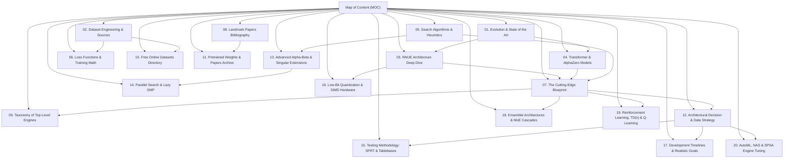

# 🧠 Map of Content: The Neural Chess Engine Vault

Welcome to the **Apex Knowledge Vault**, a comprehensive research repository covering the theory, mathematics, architectures, and implementation paradigms of modern computer chess.

---

## 🗺️ Reading Pathways & Structure

### 1. [[01-Evolution-and-SOTA|Evolution and State of the Art]]
The 70-year trajectory of computer chess:
- Claude Shannon's Type-A vs Type-B strategies (1950)
- The Handcrafted Evaluation (HCE) era: Deep Blue, Crafty, Stockfish 1-11
- The Deep Reinforcement Learning rupture: AlphaZero (2017) and Leela Chess Zero (Lc0)
- The NNUE Revolution: Stockfish 12 to 17 (2020–present)
- The Transformer & Searchless era: DeepMind Searchless Chess (2024)

### 2. [[02-Dataset-Engineering|Dataset Engineering & Corpus Acquisition]]
How datasets are mined, filtered, and vectorized:
- Lichess Open Database (billions of rated games and Stockfish evals)
- CCRL / TCEC engine tournament archives
- Stockfish Fishtest self-play dumps (`.bin` and `.binpack` format)
- Syzygy Endgame Tablebases (3-4-5-6-7 man exact WDL and DTZ)
- Feature extraction pipelines: Bitboards, HalfKP, HalfKA_v2, and 8x8x14 spatial tensors.

### 3. [[03-NNUE-Architecture-Deep-Dive|NNUE Architecture Deep Dive]]
The secret behind 100M+ nodes per second:
- Sparse feature representation: HalfKP ($41,024$ inputs) vs HalfKA_v2 ($700,000+$ inputs)
- The Incremental Accumulator: $O(1)$ updates on piece moves
- Activation functions: ClippedReLU and SCReLU (Squared Clipped ReLU)
- Fixed-point SIMD quantization (int8/int16) on AVX2, AVX-512, and ARM NEON
- Dual-network architectures (Stockfish 16/17 Big/Small nets).

### 4. [[04-Transformer-and-AlphaZero-Models|Transformer and AlphaZero Architectures]]
Beyond brute-force search:
- AlphaZero & Lc0 Deep Residual CNNs (20-40 blocks, Squeeze-and-Excitation)
- Multi-Head Self-Attention on 64 chess squares (ViT-style spatial tokens)
- Searchless Chess (Ruoss et al., 2024): 270M parameter decoder-only transformer reaching 2895 Elo
- Policy representations: $1968$ action space vs Move-target coordinates.

### 5. [[05-Search-Algorithms-and-Optimizations|Search Algorithms & Pruning Heuristics]]
Modern tree search techniques:
- Negamax with Alpha-Beta Pruning
- Principal Variation Search (PVS) & Aspiration Windows
- Transposition Tables with Zobrist 64-bit hashing
- Advanced Pruning: Null Move Pruning (NMP), Reverse Futility Pruning (RFP), ProbCut
- Reductions: Late Move Reductions (LMR) based on depth and move count
- Quiescence Search: Tactical stabilization and Static Exchange Evaluation (SEE).

### 6. [[06-Loss-Functions-and-Training-Math|Loss Functions & Training Mathematics]]
The objective functions that train modern engines:
- Win/Draw/Loss (WDL) Cross-Entropy vs Centipawn MSE
- Sigmoid Centipawn mapping: $P(W) = \frac{1}{1 + 10^{-cp / 400}}$
- Policy Cross-Entropy with temperature and visit-count distribution
- Multi-task loss combinations:
  $$\mathcal{L} = \alpha \mathcal{L}_{\text{WDL}} + \beta \mathcal{L}_{\text{Score}} + \gamma \mathcal{L}_{\text{Policy}}$$
- Gradient accumulation, AdamW, and Cosine Annealing schedules.

### 7. [[07-Cutting-Edge-Engine-Blueprint|The Cutting-Edge Engine Blueprint]]
How to build an engine that surpasses Stockfish:
- The Move-Ordering Bottleneck: Replacing heuristic move ordering with a neural policy prior
- Speculative Dual-Engine Architecture: 50M nps NNUE for quiet nodes + Deep Transformer for critical branch points
- Syzygy 7-man knowledge distillation
- End-to-end Python/PyTorch and C++ integration.

### 8. [[08-Landmark-Papers-Bibliography|Landmark Papers & Annotated Bibliography]]
15+ pivotal research papers with links, author summaries, and algorithmic breakthroughs.

### 9. [[09-Taxonomy-of-Top-Level-Engines|Taxonomy of Top-Level Engines]]
Architectural comparative breakdown of Stockfish, Leela Chess Zero, Komodo Dragon, Berserk, Torch, and Ethereal.

### 10. [[10-Free-Online-Chess-Datasets|Free Online Chess Datasets]]
Curated directory of public datasets: Lichess Open Database (5.5B games), CCRL, CC-RL, and 17.5TB Syzygy tablebases.

### 11. [[11-Pretrained-Model-Weights-and-Paper-Archives|Pretrained Model Weights & Paper Archives]]
Direct download links for official Stockfish `.nnue` nets, Lc0 networks, Maia models, and research archives.

### 12. [[12-Architectural-Decision-Matrix-and-Data-Strategy|Architectural Decision Matrix & Data Strategy]]
Systematic trade-off analysis balancing latency, memory footprint, throughput, and Elo gains.

### 13. [[13-Advanced-Alpha-Beta-Pruning-and-Extensions|Advanced Alpha-Beta Pruning & Singular Extensions]]
Algorithmic deep-dive into Reverse Futility Pruning, Probcut, Singular Extensions, and Multi-Cut.

### 14. [[14-Parallel-Search-and-Lazy-SMP|Parallel Search & Lazy SMP]]
Shared lockless Transposition Tables, helper thread diversification, and multi-core scaling efficiency.

### 15. [[15-Testing-Methodology-SPRT-and-Tablebases|Testing Methodology: SPRT & Tablebases]]
Sequential Probability Ratio Testing (SPRT) math, log-likelihood ratios, and Cutechess automation.

### 16. [[16-Low-Bit-Quantization-and-SIMD-Hardware|Low-Bit Quantization & SIMD Hardware Execution]]
Quantization math (INT8/INT4), symmetric scaling, and AVX2/AVX-512 VNNI dot-product assembly.

### 17. [[17-Engine-Development-Timelines-and-Milestones|Engine Development Timelines & Realistic Milestones]]
Historical development timelines of top engines and realistic milestones for ApexChess.

### 18. [[18-Ensemble-Architectures-and-Mixture-of-Experts|Ensemble Architectures & MoE Cascades]]
Overcoming the 50-nanosecond latency paradox using Asymmetric Cascades and Game-Phase Mixture of Experts.

### 19. [[19-Reinforcement-Learning-TD-Lambda-and-Q-Learning|Reinforcement Learning, TD(λ) & Q-Learning]]
Why naive DQN fails in chess, and how Search-Integrated TD-Leaf($\lambda$) and AlphaZero self-play achieve superhuman mastery.

### 20. [[20-AutoML-Hyperparameter-Tuning-and-NAS|AutoML, NAS & SPSA Engine Tuning]]
Automating neural architecture search for NNUE and automated parameter tuning of 100+ search heuristics via SPSA.

### 21. [[21-The-4000-Elo-Frontier-and-Singularity|The 4000 Elo Frontier & Singularity]]
Mathematical feasibility of 4000 Elo (+260 over Stockfish 19), breaking the move-ordering ceiling ($b \approx 1.3$), and the 5-pillar master plan.

---

> [!TIP]
> Use Obsidian's **Graph View** (`Ctrl+G`) to explore connections between mathematical loss functions, feature representations, and search heuristics.

