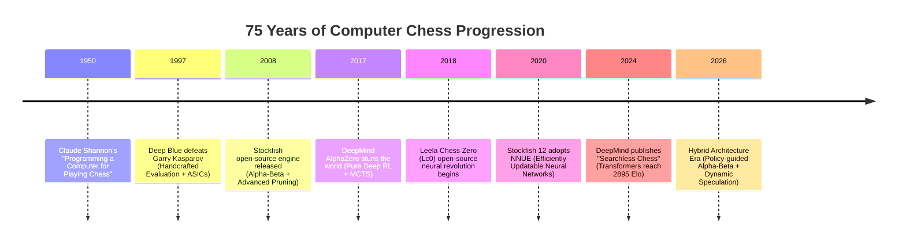

# 📜 Evolution & State of the Art in Computer Chess

Computer chess is often hailed as the "drosophila of Artificial Intelligence." For over seven decades, breakthroughs in algorithmic search, heuristic evaluation, and deep representation learning have transformed the domain from 1950s theoretical papers into superhuman intelligence operating at **3650+ CCRL / FIDE-equivalent Elo**.



---

## 1. Era 1: Shannon, Minimax, and Handcrafted Evaluation (1950 – 2017)

### Shannon's Foundational Taxonomy (1950)
Claude Shannon proposed two primary paradigms for chess programming:
- **Type-A Strategy (Brute Force)**: Search every legal move uniformly to a fixed depth $d$.
  - Branching factor $b \approx 35$. At depth $d=6$, the tree contains $35^6 \approx 1.83 \times 10^9$ positions.
  - Impractical without aggressive branch-cutting.
- **Type-B Strategy (Selective Search)**: Select only plausible candidate moves, mimicking human master intuition.
  - Historically proved difficult because heuristic filters discarded obscure, counter-intuitive tactical brilliance ("tactical blindness").

### The Dominance of Handcrafted Evaluation (HCE)
For decades, engines married **Type-A Alpha-Beta search** with deep handcrafted evaluation terms:
1. **Material Balances**: Scaled piece values (Pawn=100, Knight=320, Bishop=330, Rook=500, Queen=900).
2. **Piece-Square Tables (PST / PeSTO)**: Positional affinity matrices encouraging knights to central outposts and pawns to control the center.
3. **Pawn Structure Analysis**: Penalties for doubled, isolated, backward, and backward-on-open-file pawns; bonuses for passed pawns and pawn phalanxes.
4. **King Safety**: Pawn shield evaluation, storm detection, attacker count vs defender count, virtual queen checks.
5. **Mobility and Space**: Safe squares reachable by rooks, bishops, and queens.
6. **Tapered Evaluation**: Interpolation between Opening (MG) and Endgame (EG) phases based on non-pawn material:
   $$\text{Eval} = \frac{\text{Phase} \times \text{Eval}_{\text{MG}} + (24 - \text{Phase}) \times \text{Eval}_{\text{EG}}}{24}$$

### The Ceiling of HCE
By 2017, top HCE engines (Stockfish 8/9, Komodo 11, Houdini 6) reached ~3400-3450 Elo. However, human engineers hit the **Feature Interaction Wall**:
- Adding a new positional term (e.g., "bishop trapped behind pawn chain") often broke 10 other delicate evaluations.
- Automated parameter tuning (Texel's tuning and SPSA - Simultaneous Perturbation Stochastic Approximation) faced quadratic parameter explosion with diminishing returns.

---

## 2. Era 2: Deep Reinforcement Learning & MCTS (2017 – 2020)

### DeepMind's AlphaZero (December 2017)
DeepMind shattered the classical paradigm with **AlphaZero**:
- **Zero Human Domain Knowledge**: Learned entirely from the rules of chess via self-play reinforcement learning.
- **Dual Policy-Value ResNet**: A 20-block residual neural network took an $8 \times 8 \times 119$ tensor representation of the board history and produced:
  1. A move policy distribution $\pi(a|s)$ over all 4,096 possible piece moves.
  2. A scalar game outcome prediction $v \in [-1, +1]$ representing expected game utility.
- **Monte Carlo Tree Search (MCTS)**: Guided by the PUCT (Predictor Upper Confidence Bound applied to Trees) formula:
  $$U(s, a) = c_{\text{puct}} \cdot P(s, a) \cdot \frac{\sqrt{N(s)}}{1 + N(s, a)}$$

### AlphaZero's Style & Impact
AlphaZero crushed Stockfish 8 in a 100-game match (+28 -0 =72). It played with unprecedented aesthetic intuition:
- Unorthodox long-term piece sacrifices for piece activity.
- Deep king walks and pawn storm asphyxiations.
- Total disdain for material parity when positional domination was attainable.

### Leela Chess Zero (Lc0)
The open-source community created **Leela Chess Zero (Lc0)** using distributed volunteer computing (via BOINC/lc0 client):
- Expanded the ResNet architecture from 20 blocks up to 40 blocks, 512 filters, and Squeeze-and-Excitation (SE) attention blocks.
- Won multiple TCEC Superfinals (TCEC 15, TCEC 17) against Stockfish HCE.
- **The Hardware Constraint**: Lc0 required high-end Nvidia Tensor-core GPUs (A100, RTX 3090/4090) to evaluate ~50,000–100,000 positions per second. On CPU, Lc0 was crippled (~1,000 nps), while Stockfish evaluated 50,000,000 nps on consumer multicore CPUs.

---

## 3. Era 3: The NNUE Revolution (2020 – Present)

### What is NNUE?
**NNUE** stands for *Efficiently Updatable Neural Network* (originally developed for Shogi by Yu Nasu in 2018). In August 2020, Stockfish integrated NNUE (Stockfish 12), sparking the greatest discontinuous jump in open-source computer chess history: **+100 to +150 Elo in a single release**.

```
+------------------------------------------------------------------------+
|                               NNUE FLOW                                |
|                                                                        |
|  Current Board      [ Move made: e2-e4 ]                                |
|        |                     |                                         |
|        v                     v                                         |
|  Sparse Feature        Incremental                                     |
|  Vector (HalfKP)  ==>  Accumulator Delta ==> ClippedReLU ==> Dense MLP |
|  [41,024 dims]         (Only subtract old    [1024 / 2048]   [16x32x1] |
|                        e2 pawn, add e4 pawn)                           |
|                        O(1) Vector Add!                                |
+------------------------------------------------------------------------+
```

### Why NNUE Won the Compute War
1. **Incremental Evaluation ($O(1)$ updates)**:
   - When a chess move occurs, only 1 or 2 pieces change position.
   - The first layer features (e.g. `HalfKP`: King-Piece relationships) do not need to be recalculated from scratch.
   - The engine simply subtracts the departing piece's weights and adds the destination piece's weights to an accumulator vector.
2. **Fixed-Point Quantization & Vector SIMD**:
   - Weights and activations are quantized to signed 8-bit or 16-bit integers (`int8_t` / `int16_t`).
   - Modern CPU SIMD extensions (`AVX2`, `AVX-512`, `VNNI`, `ARM Neon`) evaluate the dense layers in microseconds.
   - Stockfish sustained **50,000,000 – 100,000,000 nodes/sec** while running a deep neural network on every searched node!
3. **Dual-Network Architecture (Stockfish 16 & 17)**:
   - Modern Stockfish uses two networks:
     - **Small Net** (~1.5 MB): Evaluates simple, quiet positions at ultra-high speed.
     - **Big Net** (~60 MB): Evaluates complex, tactically ambiguous positions with high precision.

---

## 4. Era 4: Transformers & Searchless Chess (2024 – Present)

In February 2024, DeepMind researchers (Ruoss et al.) published **"Grandmaster-Level Chess Without Search"**:
- **Architecture**: A 270M parameter decoder-only Transformer.
- **Training**: Trained on 10 million games (action-value pairs predicted by Stockfish 16 at high search depth).
- **Results**:
  - Achieved **2895 Blitz Elo on Lichess** with **0 search nodes** (pure feed-forward inference).
  - Outperformed pure AlphaZero without search and demonstrated that deep spatial attention can internalize complex tactical patterns without tree traversal.
- **The Blind Spot of Pure Transformers**:
  - Lacking dynamic tree search, pure transformers can stumble into tactical traps ("horizon effect" in deep forcing lines, e.g., 18-move clearance sacrifices).
  - High computational latency per move (~50-100 ms per forward pass) makes them unsuitable for deep tree search without architectural distillation.

---

## 5. Comparative Matrix: Architectural Paradigms

| Metric / Attribute | Classical HCE (Stockfish 10) | Deep RL + MCTS (AlphaZero / Lc0) | NNUE + Alpha-Beta (Stockfish 17) | Pure Transformer (DeepMind 2024) | Next-Gen Hybrid (ApexChess) |
| :--- | :--- | :--- | :--- | :--- | :--- |
| **Primary Evaluator** | Handcrafted functions | 20-40 block ResNet | Quantized HalfKA MLP | 270M Decoder Transformer | Dual NNUE + Distilled Policy ViT |
| **Search Mechanism** | Alpha-Beta (PVS) | MCTS (PUCT) | Alpha-Beta (PVS) | **None** (Greedy argmax) | Policy-guided Alpha-Beta (PVS) |
| **Throughput (NPS)** | 80M - 120M nps (CPU) | 40k - 100k nps (GPU) | 60M - 100M nps (CPU) | 10 - 20 nps (GPU) | 45M - 80M nps (Hybrid) |
| **Positional Insight** | Moderate (tuned rules) | Transcendent | Superhuman | Grandmaster-level | Superhuman + Adaptive |
| **Tactical Sharpness** | Extreme | High (compute-bound) | Unmatched | Vulnerable in 15+ ply lines | Unmatched |
| **Peak Playing Elo** | ~3450 | ~3550 | **~3650+** | ~2895 | **Targeting 3700+** |

---

## 6. What's Next?

To surpass Stockfish 17, an engine cannot merely replicate NNUE. The path forward requires resolving the fundamental structural weakness of modern Alpha-Beta engines: **Heuristic Move Ordering**.

➡️ Proceed to:
- [[02-Dataset-Engineering|Dataset Engineering & Sources]]
- [[03-NNUE-Architecture-Deep-Dive|NNUE Architecture Deep Dive]]
- [[07-Cutting-Edge-Engine-Blueprint|The Cutting-Edge Engine Blueprint]]
