# 📊 Dataset Engineering & Corpus Acquisition

A superhuman chess engine is only as good as its training corpus. Training a modern neural evaluation system requires handling **hundreds of millions to billions of chess positions**, balancing opening diversity, tactical sanity, endgame perfection, and evaluation fidelity.

```mermaid
flowchart LR
    subgraph RawSources["Raw Data Sources"]
        Lichess["Lichess Game Dumps\n(5B+ Games, Zstandard PGN)"]
        SF_Evals["Lichess Open Evals\n(Deep Stockfish 16 Evals)"]
        Fishtest["Stockfish Fishtest\n(.binpack self-play data)"]
        Syzygy["Syzygy Tablebases\n(3-4-5-6-7 Man exact WDL/DTZ)"]
    end

    subgraph FilterPipe["Filtering & Cleaning"]
        EloFilt["Filter Elo >= 2300"]
        BookSkip["Skip Plies 1-10 (Book)"]
        Quiescence["Quiet / Non-Check Filter"]
        DeDupe["Transposition De-duplication"]
    end

    subgraph Vectorization["Vector Encoding"]
        Sparse["HalfKP / HalfKA Indices\n(Sparse int32 for NNUE)"]
        Tensor["8x8x14 Spatial Tensors\n(Dense float32 for Transformers)"]
        Bitboards["64-bit Bitboards\n(Bit-manipulation ops)"]
    end

    RawSources --> FilterPipe
    FilterPipe --> Vectorization
```



---

## 1. Primary Data Sources

### 1.1 Lichess Open Database
The [Lichess Open Database](https://database.lichess.org/) is the single largest public repository of human and engine games in existence:
- **Volume**: Over 5.5 billion standard chess games recorded since 2013, growing by ~100 million games per month.
- **Format**: Compressed PGN files using `zstandard` (`.pgn.zst`), containing clock times, Elo ratings, evaluations, and move timestamps.
- **Lichess Open Evaluations**: A specialized database dump containing over **300 million unique FEN positions** evaluated by deep Stockfish instances (depth 30-50 plies).
  - Schema per entry:
    ```json
    {
      "fen": "r1bqk2r/pp2bppp/2n1pn2/2pp4/2PP4/2N1PN2/PP2BPPP/R1BQK2R w KQkq - 4 7",
      "eval": 24,
      "pvs": [{"moves": "c4d5 e6d5 e1g1", "cp": 24}],
      "depth": 38,
      "knodes": 45120
    }
    ```

### 1.2 Stockfish Fishtest Self-Play Data (`.bin` / `.binpack`)
The Stockfish team produces billions of self-play games through the distributed [Fishtest framework](https://tests.stockfishchess.org/):
- **High-Entropy Positions**: Generated from random opening book positions (e.g. UHO - Ultra High Opening books) played out under tournament time controls.
- **`.binpack` Format**: A highly compressed custom binary format storing:
  - Compressed FEN (Huffman-like bit-level board packing, ~24-32 bytes per position).
  - Centipawn score or Mate score from search root.
  - Game result ($1.0, 0.5, 0.0$).
  - Search depth and best move.

### 1.3 Syzygy Endgame Tablebases
For positions with 7 pieces or fewer on the board, chess has been **completely solved**:
- **3-4-5-6 Man Syzygy**: ~150 GB in total size.
- **7-Man Syzygy**: ~17.5 TB in total size.
- **Metric Tables**:
  - `WDL` (Win/Draw/Loss): Gives exact outcome under optimal play, taking 50-move rule into account.
  - `DTZ` (Distance to Zeroing): Moves until the next pawn move or piece capture.
  - `DTM` (Distance to Mate): Exact plies until checkmate.

---

## 2. Filtering & Curation Pipeline

Blindly ingesting millions of games results in low-quality models. Modern pipelines enforce rigorous filtering:

```python
def should_include_position(game, board, ply, eval_cp):
    # 1. Elo Quality Filter
    if game.headers.get("WhiteElo", 0) < 2200 or game.headers.get("BlackElo", 0) < 2200:
        return False
    
    # 2. Skip Opening Book Memorization (first 8-12 plies)
    if ply < 10:
        return False
    
    # 3. Filter Tactical Noise / In-Check positions
    if board.is_check():
        return False  # NNUE prefers quiet positions; tactical search handles checks
        
    # 4. Filter wild blunder positions (swings > 1000 cp in 1 ply)
    if abs(eval_cp) > 1500:
        return False
        
    return True
```

### Key Filtering Rules
1. **Elo Thresholding**: Human games below 2200 Elo contain frequent blunders that pollute gradient signals.
2. **Opening Ply Exclusion**: Early plies (1–10) are heavily determined by opening theory and book repetitions. Including them uniformly over-represents starting positions.
3. **Tactical Quiescence Filtering**: For training static position evaluators (NNUE), positions where a major capture or check is forced should be excluded unless evaluated through quiescent search depth.
4. **Outcome Blunder Balancing**: A game won by White may include a blunder where White was at -500 cp for 3 moves. Evaluating those positions as "1.0 (White won)" introduces noise; positions must be supervised by **both game outcome and instantaneous engine evaluation**.

---

## 3. Position Encoding & Representation

### 3.1 Bitboards (The Foundational Engine Primitive)
A bitboard is an unsigned 64-bit integer (`uint64_t`) where each bit corresponds to one square on the $8 \times 8$ board ($a1 = 0, b1 = 1, \dots, h8 = 63$).
A complete state consists of 14 bitboards:
- 6 for White pieces ($\text{P, N, B, R, Q, K}$)
- 6 for Black pieces ($\text{p, n, b, r, q, k}$)
- 1 for Occupied White squares
- 1 for Occupied Black squares

```
Bitboard indexing:
 8 | 56 57 58 59 60 61 62 63
 7 | 48 49 50 51 52 53 54 55
 6 | 40 41 42 43 44 45 46 47
 5 | 32 33 34 35 36 37 38 39
 4 | 24 25 26 27 28 29 30 31
 3 | 16 17 18 19 20 21 22 23
 2 |  8  9 10 11 12 13 14 15
 1 |  0  1  2  3  4  5  6  7
   -------------------------
      a  b  c  d  e  f  g  h
```

### 3.2 HalfKP Feature Representation (NNUE)
**HalfKP** (Half-board King-Piece) models the relationship between the friendly King and every other piece on the board:
- White's perspective: Friendly King square $k \in [0, 63]$, piece type and square $p \in [0, 10 \times 64 - 1 = 639]$.
- Dimension: $64 \times (10 \times 64) = 40,960$ features per perspective.
- Active features: Exactly $\le 30$ active (non-zero) binary inputs per position!
- **Sparsity**: $>99.9\%$ sparse, enabling sparse pointer accumulation.

### 3.3 HalfKA_v2 Feature Representation (Stockfish 15+)
**HalfKA_v2** expands HalfKP to include King-Piece-Adjacent configurations and piece-to-piece affinities:
- Extends the feature space to **over 700,000 sparse indices**, capturing subtle bishop diagonal cuts and rook file pressure relative to the king.

### 3.4 Spatial Tensors (Transformers & ResNets)
For convolutional or transformer models, the board is vectorized as an $8 \times 8 \times C$ tensor:
- $C = 14$ base channels (6 white piece types, 6 black piece types, 1 repetition plane, 1 en-passant plane).
- Optional auxiliary features: Castling rights (4 bits), side to move (1 bit), 50-move rule counter (1 scalar).

---

## 4. Label Engineering: Soft Target Blending

How do we represent "goodness" of a position?

### 4.1 Sigmoid Winning Probability Function
Engine centipawns ($cp$) are converted to a smooth win probability $P(\text{Win}) \in [0, 1]$ via the logistic sigmoid:
$$P(\text{Win}) = \frac{1}{1 + 10^{-cp / S}}$$
Where $S$ is a scaling factor (typically $S = 400$ or $S = 360$ in modern Stockfish calibrations).
- $+100 \text{ cp} \approx 64\%$ win probability.
- $+400 \text{ cp} \approx 90\%$ win probability.
- $0 \text{ cp} = 50\%$ (dead draw).

### 4.2 Lambda Target Blending
To prevent overfitting to engine evaluation artifacts or game blunder outcomes, modern engines use a **linear target blend**:
$$y_{\text{target}} = \lambda \cdot z + (1 - \lambda) \cdot \sigma\left(\frac{cp}{S}\right)$$
Where:
- $z \in \{1.0, 0.5, 0.0\}$ is the final game outcome (win, draw, loss).
- $cp$ is the deep search evaluation score.
- $\lambda \in [0.1, 0.25]$ weights real empirical victory against local search truth.

---

➡️ Proceed to:
- [[03-NNUE-Architecture-Deep-Dive|NNUE Architecture Deep Dive]]
- [[06-Loss-Functions-and-Training-Math|Loss Functions & Training Math]]
