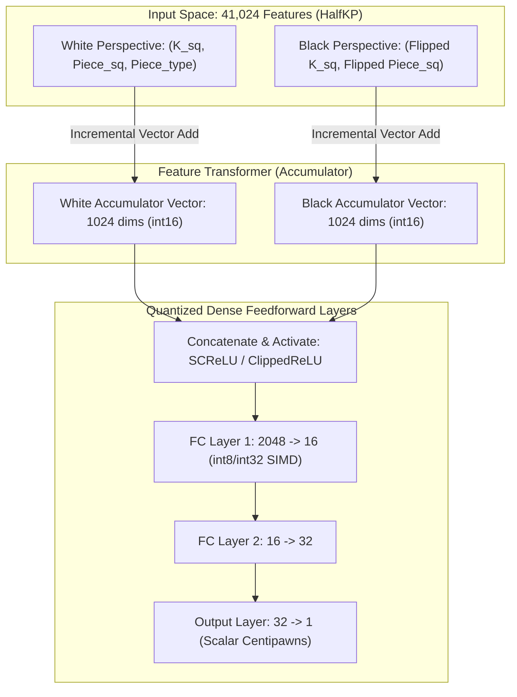

# ⚡ NNUE Architecture Deep Dive

**NNUE** (Efficiently Updatable Neural Network) is arguably the most impactful computational invention in the history of computer chess. It reconciled the trade-off between the expressive depth of deep learning and the raw, blazing tree-traversal speed of Alpha-Beta pruning (50M–100M nodes/sec).



---

## 1. The Core Secret: Incremental Accumulation

In standard neural networks, evaluating a new board state requires a complete forward pass through all parameters:
$$\mathbf{h}_1 = f(\mathbf{W}_1 \mathbf{x} + \mathbf{b}_1)$$
With $\mathbf{x} \in \mathbb{R}^{41024}$ and $\mathbf{h}_1 \in \mathbb{R}^{1024}$, computing $\mathbf{W}_1 \mathbf{x}$ requires over **42 million multiply-accumulate operations** per node. In a 50M nps search, this would require $2 \times 10^{15}$ operations per second—impossible on consumer hardware.

### The Incremental Realization
When a move occurs (e.g. Knight moves from $g1$ to $f3$):
1. Exactly **one** active feature leaves the board (Knight on $g1$).
2. Exactly **one** active feature enters the board (Knight on $f3$).
3. The remaining active features do not change.

Instead of recalculating $\mathbf{W}_1 \mathbf{x}$, the accumulator state $\mathbf{A}_{t+1}$ is computed via simple vector addition:
$$\mathbf{A}_{t+1} = \mathbf{A}_t - \mathbf{W}[\text{old\_feature}] + \mathbf{W}[\text{new\_feature}]$$

- **Complexity**: $O(K)$ vector additions (where $K = 1024$ dimensions of the accumulator), independent of the input feature space size ($41,024+$ features).
- **Time Taken**: Less than 10 nanoseconds using AVX2/AVX-512 SIMD instructions!

---

## 2. Dual Perspective Symmetry

Because chess rules are symmetric with respect to color, the network maintains two separate accumulators for every position:
- **Perspective 0 (White)**: King at square $k_w$, friendly pieces, opponent pieces.
- **Perspective 1 (Black)**: King at square $k_b$ vertically mirrored ($s \oplus 56$), friendly pieces, opponent pieces.

When it is White's turn to move:
$$\mathbf{H} = [\text{Activate}(\mathbf{A}_{\text{White}}), \text{Activate}(\mathbf{A}_{\text{Black}})]$$
When it is Black's turn to move:
$$\mathbf{H} = [\text{Activate}(\mathbf{A}_{\text{Black}}), \text{Activate}(\mathbf{A}_{\text{White}})]$$

This ensures absolute evaluation symmetry: $\text{Eval}(s) = -\text{Eval}(\text{mirror}(s))$.

---

## 3. Activation Functions: ClippedReLU vs SCReLU

### 3.1 ClippedReLU
The original NNUE activation function:
$$\text{ClippedReLU}(x) = \min(\max(x, 0), 127)$$
- **Hardware Affinity**: Bounded strictly to $[0, 127]$, which fits natively into an unsigned 8-bit integer (`uint8_t`).

### 3.2 SCReLU (Squared Clipped ReLU)
Modern Stockfish (SF 15+) replaced ClippedReLU with **SCReLU**:
$$\text{SCReLU}(x) = \left[\min(\max(x, 0), 127)\right]^2$$
- **Non-Linear Dynamics**: The quadratic response amplifies strong positional signals (e.g. passed pawns or open diagonals) while compressing subtle noise.
- Provides a measurable **+15 to +20 Elo gain** over linear ClippedReLU.

---

## 4. Hardware Quantization & SIMD Assembly

In production engines, NNUE never runs in floating-point `float32`. Every operation is quantized into integer fixed-point math:

| Component | Quantization Type | Scale Factor | Hardware Instruction |
| :--- | :--- | :--- | :--- |
| **Input Weights** | Signed 16-bit (`int16_t`) | $\times 256$ | `_mm256_add_epi16` / `_mm512_add_epi16` |
| **Accumulator State** | Signed 16-bit (`int16_t`) | $\times 256$ | Fast memory register cache |
| **Dense Weights** | Signed 8-bit (`int8_t`) | $\times 64$ | `_mm256_maddubs_epi16` |
| **Intermediate Accumulator** | Signed 32-bit (`int32_t`) | $\times 16384$ | `_mm512_dpbusd_epi32` (VNNI) |
| **Output Centipawns** | Signed 32-bit integer | De-scaled | Shift right (`>> 16`) |

```c
// Example AVX-512 VNNI Vector Dot-Product (Dense Layer)
__m512i vec_act = _mm512_loadu_si512((__m512i*)activations);
__m512i vec_w   = _mm512_loadu_si512((__m512i*)weights);
__m512i sum     = _mm512_dpbusd_epi32(accumulator, vec_act, vec_w);
```

Using VNNI (Vector Neural Network Instructions), modern Intel and AMD processors perform **64 8-bit multiply-accumulate operations in a single clock cycle**.

---

## 5. Dual Network System: Small Net vs Big Net

Stockfish 16 and 17 introduced a **Dual-NNUE architecture**:
- **Big Net** (~60 MB):
  - $2048$ accumulator dimensions $\rightarrow 16 \rightarrow 32 \rightarrow 1$.
  - Extreme positional sensitivity, subtle pawn tension comprehension.
- **Small Net** (~1.5 MB):
  - $512$ accumulator dimensions $\rightarrow 8 \rightarrow 1$.
  - 3x faster execution.

### Dynamic Switching Policy:
1. At search nodes with high material imbalance or positions where alpha-beta bounds are distant, call the **Small Net**.
2. If the Small Net evaluation is within an uncertainty window $[\alpha - \delta, \beta + \delta]$, trigger the **Big Net** for surgical precision.
3. This hybrid evaluation yielded **+25 Elo** while preserving search speed!

---

➡️ Proceed to:
- [[04-Transformer-and-AlphaZero-Models|Transformer & AlphaZero Models]]
- [[05-Search-Algorithms-and-Optimizations|Search Algorithms & Pruning]]
- [[07-Cutting-Edge-Engine-Blueprint|The Cutting-Edge Engine Blueprint]]
