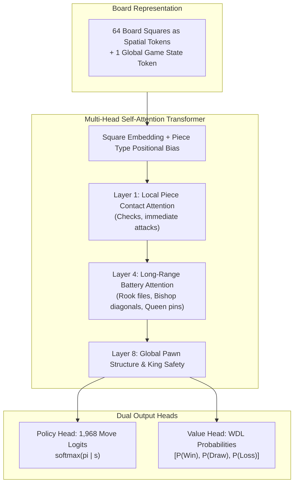

# 🤖 Transformer and AlphaZero Architectures in Computer Chess

While NNUE rules the domain of high-speed Alpha-Beta search, **Deep Residual Networks** and **Transformers with Spatial Multi-Head Attention** represent the frontier of strategic vision and human-like intuition.

---

## 1. The AlphaZero / Leela Chess Zero ResNet Paradigm

AlphaZero (DeepMind, 2017) and Leela Chess Zero (Lc0, 2018–present) pioneered deep policy-value networks:

### 1.1 Input Tensor Structure
The input to the ResNet is an $8 \times 8 \times C$ tensor (typically $C = 112$ to $119$ channels):
- 12 channels for current piece placements (White: P, N, B, R, Q, K; Black: p, n, b, r, q, k).
- $T-1$ past board states (usually $T=8$ plies of history) to allow the network to perceive movement direction and repetition rules.
- Scalar planes: Color to move (all 1s if White, 0s if Black), total move count, castling rights, and 50-move rule counter.

### 1.2 The Residual Tower
- **Backbone**: 20 to 40 Residual Blocks.
- **Squeeze-and-Excitation (SE) Units**: Lc0 introduced SE blocks to model global channel-wise feature dependencies:
  $$\mathbf{z} = \text{GlobalAveragePool}(\mathbf{X}), \quad \mathbf{s} = \sigma(\mathbf{W}_2 \text{ReLU}(\mathbf{W}_1 \mathbf{z})), \quad \widetilde{\mathbf{X}} = \mathbf{s} \odot \mathbf{X}$$
- **Strengths**: Excels at spatial convolution, identifying local pawn structures, outposts, and tactical forks.

---

## 2. Spatial Attention & Chess Transformers

Convolutions have an inherent limitation: their receptive field grows linearly with depth. A bishop on $a1$ exerting pressure on $h8$ requires multiple convolutional layers to propagate information across the 7-square diagonal.

In a **Chess Transformer**:
- Every square on the $8 \times 8$ board is treated as an individual token ($\mathbf{x}_i \in \mathbb{R}^{d}$, where $i \in [0, 63]$).
- A 65th token ($\mathbf{x}_{\text{global}}$) encodes side to move, castling rights, and halfmove clock.
- **Direct Global Interaction**: The Attention mechanism allows any piece on any square to immediately attend to every other piece in $O(1)$ layer depth:
  $$\text{Attention}(\mathbf{Q}, \mathbf{K}, \mathbf{V}) = \text{softmax}\left(\frac{\mathbf{Q} \mathbf{K}^T}{\sqrt{d_k}}\right) \mathbf{V}$$

### What the Attention Weights Learn
Probing trained chess transformers reveals interpretable attention patterns:
1. **Ray Attention**: Rooks attend heavily down their open rank and file; Bishops attend along diagonals.
2. **Defensive Ties**: Pieces under attack attend strongly to their friendly defenders.
3. **King Proximity**: When a king is exposed, all opponent attacking pieces distribute large attention weights toward the king square.

---

## 3. DeepMind's "Searchless Chess" (Ruoss et al., 2024)

In early 2024, DeepMind demonstrated the raw expressive power of modern transformers in computer chess:
- **Model**: 270M-parameter decoder-only transformer (16 layers, 1024 embedding dimension, 16 attention heads).
- **Corpus**: 10 million games from Lichess annotated with Stockfish 16 action-values.
- **Mechanism**:
  - The model does **no tree search whatsoever** ($N = 1$ forward evaluation).
  - Given a board state, it predicts the expected action-value $Q(s, a)$ for all legal moves and greedily selects:
    $$a^* = \arg\max_{a \in \mathcal{A}(s)} Q(s, a)$$
- **Performance**:
  - Reached **2895 Blitz Elo** on Lichess.
  - Defeated Grandmaster bots and classical search engines up to master strength.
  - Successfully solved complex tactical puzzles involving sacrifices, pins, and discovered attacks.

---

## 4. Policy Representation: The 1,968 Action Space

To output a probability distribution over moves $\pi(a | s)$, the network must map to a standardized action space.

In chess, there are **1,968 conceivable legal moves** from any board:
1. **Queen Moves (Rays)**: 56 move types per square (8 directions $\times$ 7 squares max distance) $\times 64 = 4096 \rightarrow$ reduced by board boundaries.
2. **Knight Moves (Hops)**: 8 leaps per square.
3. **Underpromotions**: 2 knight, 2 bishop, 2 rook promotions per pawn file.

### Softmax Over Legality Mask
During inference, illegal moves are masked with $-\infty$ before the softmax normalization:
$$\pi(a_i | s) = \frac{\exp(z_i) \cdot \mathbb{I}(a_i \in \text{LegalMoves}(s))}{\sum_{j \in \text{LegalMoves}(s)} \exp(z_j)}$$

---

## 5. Why Transformers Haven't Replaced NNUE in TCEC (Yet)

| Factor | NNUE (Stockfish 17) | Transformer (Lc0 / DeepMind) |
| :--- | :--- | :--- |
| **Inference Time** | $\sim 10 - 20$ nanoseconds | $\sim 5 - 20$ milliseconds |
| **Search Nodes per Second** | **60,000,000 nps** | **10,000 nps** (6,000x slower!) |
| **Tactical Search Depth** | Depth 35 - 50 plies | Depth 10 - 15 plies |
| **Horizon Effect Vulnerability** | Very Low (sees 40 plies deep) | Moderate in forced lines |
| **Positional Sacrifices** | Good | **Transcendental** |

### The Breakthrough Opportunity: Distillation & Hybridization
The winning strategy for the next generation of chess engines is not to choose between NNUE and Transformers, but to **fuse them**:
- Use a **distilled, ultra-fast 4-layer Policy Transformer** to order moves at the root and high-depth nodes in Alpha-Beta search.
- When the first move searched is the correct move $>85\%$ of the time, Alpha-Beta cuts off after inspecting only 1 branch!

---

➡️ Proceed to:
- [[05-Search-Algorithms-and-Optimizations|Search Algorithms & Heuristics]]
- [[07-Cutting-Edge-Engine-Blueprint|The Cutting-Edge Engine Blueprint]]
