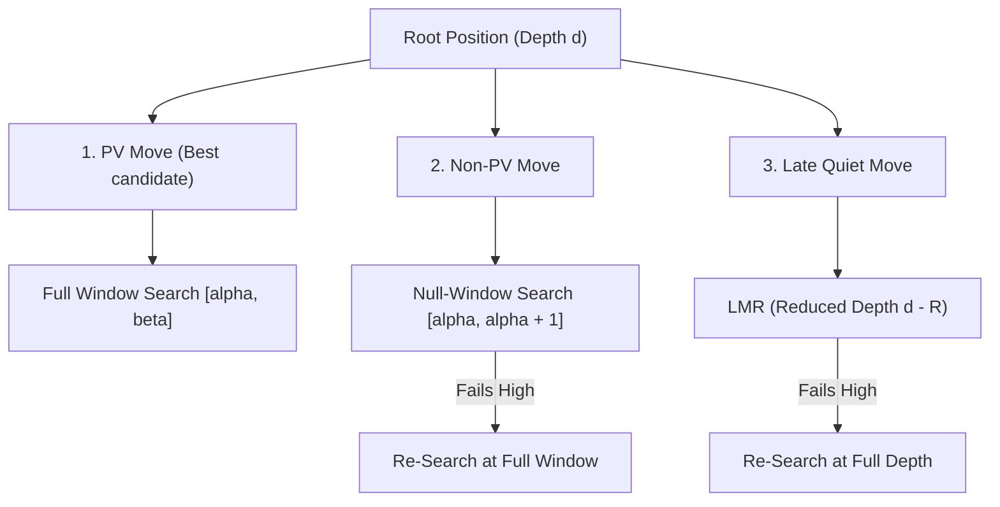

# 🔍 Search Algorithms & Tree Optimization

Even the most accurate neural evaluator cannot compensate for an inefficient search tree. In chess, a standard position has an average branching factor of $b \approx 35$. A naïve minimax search to depth 10 would examine $35^{10} \approx 2.75 \times 10^{15}$ positions—requiring over 300 days of computation at 100M nps.

Modern search engines employ **Alpha-Beta Pruning, Principal Variation Search (PVS), and deep selective heuristics** to compress the effective branching factor from $b \approx 35$ down to **$b \approx 1.5 - 2.0$**.



---

## 1. Mathematical Formulations: Negamax & Alpha-Beta

### 1.1 The Negamax Identity
Because chess is a zero-sum two-player game, White's gain is exactly Black's loss. Negamax simplifies Minimax by leveraging the mathematical identity:
$$\max(a, b) = -\min(-a, -b)$$
The score of a position from the side-to-move's perspective is:
$$\text{Negamax}(s, d) = \max_{a \in \mathcal{A}(s)} \left( -\text{Negamax}(\text{DoMove}(s, a), d - 1) \right)$$

### 1.2 Alpha-Beta Pruning
Alpha-Beta maintains a dynamic evaluation window $[\alpha, \beta]$:
- $\alpha$: The minimum score that the maximizing player is assured of.
- $\beta$: The maximum score that the minimizing opponent will permit.

Whenever a child returns a score $v \ge \beta$, the position causes a **Beta Cutoff** (fail-high). The remaining sibling moves are discarded immediately, because the opponent would never allow the game to enter this subtree.

```
Under perfect move ordering (best move evaluated first):
Branching factor collapses from b to sqrt(b)
35^10 positions  ===>  (sqrt(35))^10 = 5.9^10 ≈ 51 million positions!
(Solvable in 0.5 seconds on modern CPU)
```

---

## 2. Principal Variation Search (PVS)

PVS operates on the premise that if moves are sorted well, the **first move** searched is overwhelmingly likely to be the best move (the Principal Variation):
1. **First Move**: Searched with the full window $[\alpha, \beta]$.
2. **Subsequent Moves**: Assumed to be inferior. Searched with a minimal **Null-Window** (or Zero-Window) $[\alpha, \alpha + 1]$.
   - A null-window search is vastly faster because almost every branch immediately fails low ($v \le \alpha$) and cuts off.
3. **Re-Search on Fail-High**: If a subsequent move unexpectedly scores $v > \alpha$, the assumption was wrong. It is immediately re-searched with the full window $[v, \beta]$.

---

## 3. Transposition Tables (TT) & Zobrist Hashing

Chess games frequently transpose into identical positions via different move orders (e.g. $1. d4\ Nf6\ 2. c4$ vs $1. c4\ Nf6\ 2. d4$).

### 3.1 Zobrist Hashing
Albert Zobrist (1970) devised an incremental 64-bit XOR hash:
$$\text{Hash}_{t+1} = \text{Hash}_t \oplus \mathbf{Z}[\text{piece}, \text{from\_sq}] \oplus \mathbf{Z}[\text{piece}, \text{to\_sq}]$$
- Stored as a flat hash table in memory (typically 1 GB to 32 GB RAM).

### 3.2 TT Entry Schema
Each TT slot contains:
```c
struct TTEntry {
    uint64_t key;       // 64-bit Zobrist key for collision checking
    int16_t  score;     // Evaluated score (adjusted for mate-distance)
    int16_t  eval;      // Static evaluation before search
    uint16_t best_move; // Best move found at this node
    uint8_t  depth;     // Search depth at which entry was computed
    uint8_t  flag;      // EXACT, LOWERBOUND (Beta-cutoff), UPPERBOUND (Alpha-fail)
    uint8_t  age;       // Generation counter for cache replacement
};
```

---

## 4. Advanced Pruning & Reduction Heuristics

Modern engines achieve superhuman depth by selectively discarding $>90\%$ of the search tree:

### 4.1 Null Move Pruning (NMP)
- **Concept**: If the side to move "passes" (plays a null move, giving the opponent two turns in a row) and the resulting shallow search still produces a score $\ge \beta$, the original position is so dominant that searching further is unnecessary.
- **Zugzwang Guard**: NMP must be disabled in endgames where only kings and pawns remain, because in Zugzwang positions, passing is beneficial!

### 4.2 Reverse Futility Pruning (RFP)
- Also called *Static Null Move Pruning*. At depth $d \le 3$, if:
  $$\text{StaticEval}(s) - \text{Margin}(d) \ge \beta$$
  The node immediately returns $\text{StaticEval}(s)$ without searching any moves. Margin is typically $80 \times d$ centipawns.

### 4.3 Late Move Reductions (LMR)
If a move is quiet (not a capture or promotion), occurs late in the move list (e.g. move 4 or later), and is searched at depth $d \ge 3$, it is searched with a **reduced depth**:
$$R = 1 + \frac{\ln(d) \cdot \ln(i)}{C}$$
Where $d$ is depth, $i$ is the move index, and $C \approx 2.0$. If the reduced search beats $\alpha$, the move is re-searched at full depth.

---

## 5. Quiescence Search (Preventing the Horizon Effect)

When the depth limit $d = 0$ is reached, the search cannot simply stop. If White's queen is currently attacked by a black pawn, evaluating the board statically would produce an artificially high score because the queen hasn't been captured yet. This failure is the classic **Horizon Effect**.

**Quiescence Search**:
- Extends the search past depth 0 for **tactical moves only** (captures, promotions, and checking moves).
- Utilizes the **"Stand-Pat" heuristic**: The player is never forced to capture; if the current static eval is already $\ge \beta$, they can simply stand pat.
- Uses **Static Exchange Evaluation (SEE)** to immediately prune bad captures (e.g. Queen capturing a pawn defended by a bishop).

---

## 6. Move Ordering: The Crown Jewel

The efficiency of Alpha-Beta is $100\%$ governed by move ordering. The optimal order:
1. **Transposition Table Best Move** (PV move from earlier iterations)
2. **Good Captures** (sorted by MVV-LVA: Most Valuable Victim $\times 100$ - Least Valuable Attacker)
3. **Killer Moves** (quiet moves that triggered a beta-cutoff at the same search ply)
4. **Countermove Heuristic** (move that historically refuted the opponent's previous move)
5. **History Heuristic** (butterfly table incremented on beta cutoffs)
6. **Neural Policy Prior** (output of distilled Transformer/Policy net)
7. **Quiet Moves**
8. **Bad Captures** (negative SEE).

---

➡️ Proceed to:
- [[06-Loss-Functions-and-Training-Math|Loss Functions & Training Math]]
- [[07-Cutting-Edge-Engine-Blueprint|The Cutting-Edge Engine Blueprint]]
