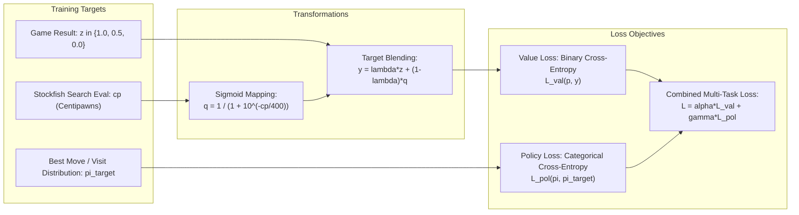

# 📐 Loss Functions & Training Mathematics

Training a neural evaluation model requires formulating an objective function that connects **raw centipawn evaluations**, **discrete game outcomes (Win/Draw/Loss)**, and **move probability distributions**.

---

## 1. Sigmoid Centipawn Mapping

In classical engines, evaluations are expressed in **centipawns** ($100 \text{ cp} = 1 \text{ pawn}$). However, gradient descent struggles with unbounded centipawns (which range from $-\infty$ to $+\infty$, with mate scores at $\pm 30,000$).

The standard mapping converts centipawns to a winning probability $q \in [0, 1]$:
$$q(cp) = \frac{1}{1 + 10^{-cp / S}}$$
Where $S$ is the scaling factor (traditionally $S = 400$ in Elo theory, calibrated to $S \approx 360 - 410$ in Stockfish):
- For $cp = 0$: $q = \frac{1}{1 + 1} = 0.5$ (50% probability = draw).
- For $cp = +400$: $q = \frac{1}{1 + 10^{-1}} = \frac{1}{1.1} \approx 0.909$ (91% win probability).
- For $cp = -400$: $q \approx 0.091$ (9% win probability).

---

## 2. Value Objective: Soft Target Cross-Entropy

Rather than treating chess evaluation as a mean squared error (MSE) regression, top engines model evaluation as a **probability of winning**.

Given predicted probability $p = \sigma(\text{model\_output} / S)$ and blended target probability:
$$y = \lambda \cdot z_{\text{outcome}} + (1 - \lambda) \cdot q(cp)$$
Where:
- $z_{\text{outcome}} \in \{0.0, 0.5, 1.0\}$ is the empirical result of the game.
- $\lambda \in [0.15, 0.25]$ is the outcome interpolation factor.

The loss is the **Binary Cross-Entropy (BCE)**:
$$\mathcal{L}_{\text{Value}}(p, y) = - \left[ y \ln p + (1 - y) \ln (1 - p) \right]$$

### Why BCE Outperforms MSE:
1. **Gradient Proportionality**: As predictions deviate from reality, the gradient of BCE remains robust, whereas MSE gradients saturate when passed through squashing non-linearities.
2. **Probabilistic Consistency**: Cross-entropy directly penalizes confident incorrectness (e.g. predicting a win on a lost position).

---

## 3. Policy Objective: Categorical Cross-Entropy

For models predicting move distributions $\mathbf{\pi} \in \mathbb{R}^{1968}$ (such as AlphaZero, Lc0, and Chess Transformers):
$$\mathcal{L}_{\text{Policy}}(\mathbf{z}, \mathbf{\pi}^*) = - \sum_{i \in \text{LegalMoves}} \pi_i^* \ln \left( \frac{\exp(z_i)}{\sum_{j \in \text{LegalMoves}} \exp(z_j)} \right)$$
Where:
- $\mathbf{z}$ are raw move logits output by the network.
- $\mathbf{\pi}^*$ is the target policy distribution (derived from MCTS visit counts $N(s, a)^{1/\tau}$ or one-hot best move from deep engine search).
- $\tau$ is the visit temperature (typically $\tau = 1.0$ early in game, $\tau \rightarrow 0$ in late game).

---

## 4. Multi-Task Combined Loss Function

In state-of-the-art hybrid models (like ApexChess), training optimizes a composite loss:
$$\mathcal{L}_{\text{Total}} = \alpha \cdot \mathcal{L}_{\text{Value}} + \beta \cdot \mathcal{L}_{\text{ScoreMSE}} + \gamma \cdot \mathcal{L}_{\text{Policy}} + \delta \cdot \mathcal{R}_{\text{Entropy}}$$

Where:
- $\mathcal{L}_{\text{ScoreMSE}} = \frac{1}{2} (cp_{\text{pred}} - cp_{\text{target}})^2$ (auxiliary direct centipawn regression).
- $\mathcal{R}_{\text{Entropy}} = - \sum_i \pi_i \ln \pi_i$ (entropy regularization preventing policy collapse onto trivial moves).
- Typical weight ratios: $\alpha = 1.0, \beta = 0.05, \gamma = 0.5, \delta = 0.001$.

---

## 5. Quantization-Aware Training (QAT)

Because production inference relies on 8-bit (`int8`) or 16-bit (`int16`) fixed-point integer arithmetic, models trained in `float32` suffer **quantization drift** when deployed.

To eliminate quantization loss, training employs **Simulated Quantization**:
$$\hat{w} = \text{clamp}\left( \left\lfloor \frac{w}{S_w} + \frac{1}{2} \right\rfloor, -128, 127 \right) \cdot S_w$$
Where $S_w$ is the dynamic scale factor.

### The Straight-Through Estimator (STE)
Because the rounding function $\lfloor \cdot \rceil$ has a derivative of zero almost everywhere:
$$\frac{\partial \lfloor x \rceil}{\partial x} = 0 \quad (\text{a.e.})$$
Standard backpropagation fails. The **Straight-Through Estimator (STE)** replaces the zero derivative with an identity pass-through during backward propagation:
$$\frac{\partial \mathcal{L}}{\partial w} \approx \frac{\partial \mathcal{L}}{\partial \hat{w}}$$

This allows the network to learn weights that naturally round to integer boundaries without degradation.

---

## 6. Optimization Dynamics: AdamW & Cosine Annealing

Modern neural chess training regimes utilize:
- **Optimizer**: `AdamW` (Loshchilov & Hutter) with decoupled weight decay ($\lambda_{\text{decay}} = 10^{-4}$).
- **Learning Rate Schedule**: **Cosine Annealing with Warm Restarts**:
  $$\eta_t = \eta_{\min} + \frac{1}{2}(\eta_{\max} - \eta_{\min})\left(1 + \cos\left(\frac{T_{\text{cur}}}{T_{\text{max}}} \pi\right)\right)$$
- **Batch Size**: 4,096 to 16,384 positions per batch to ensure smooth gradient estimates over sparse HalfKP feature representations.

---

➡️ Proceed to:
- [[07-Cutting-Edge-Engine-Blueprint|The Cutting-Edge Engine Blueprint]]
- [[08-Landmark-Papers-Bibliography|Landmark Papers & Bibliography]]
