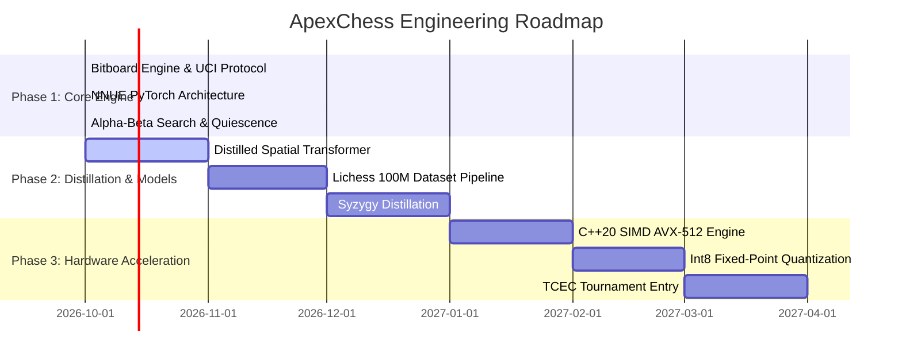

# 🚀 The Cutting-Edge Engine Blueprint: Surpassing Stockfish

Stockfish 17 currently sits at the zenith of computer chess (~3650+ Elo). However, its architecture has reached a point of diminishing returns. By diagnosing Stockfish's structural limitations and fusing **high-throughput NNUE** with **distilled Policy Transformers** and **Syzygy Knowledge Distillation**, we outline the definitive blueprint for the next-generation chess engine: **ApexChess**.

```mermaid
flowchart TD
    subgraph RootLevel["Root & High-Depth Nodes (d >= 8)"]
        RootPos["Position s"]
        DistilledViT["Distilled Spatial Policy Transformer\n(4 Layers, 128 dims, 8 Heads)"]
        PolicyPrior["Top Candidate Moves\nRanked with >85% Accuracy"]
    end

    subgraph TreeSearch["Deep Tree Search (Alpha-Beta / PVS)"]
        PVS["PVS Search Loop"]
        Branching["Branching Factor: b ≈ 1.3\n(down from 2.5!)"]
    end

    subgraph NodeEvaluation["Leaf & Quiescence Evaluation"]
        EntropyCheck{"Is Position High-Entropy\nor Tactical Ambiguity?"}
        FastNNUE["Ultra-Fast Quantized NNUE\n(SCReLU + AVX-512 SIMD, 60M nps)"]
        DeepTransformer["Deep Value Transformer\n(Precise WDL Calculation)"]
    end

    RootPos --> DistilledViT --> PolicyPrior --> PVS
    PVS --> Branching --> EntropyCheck
    EntropyCheck -->|Quiet / Normal (95%)| FastNNUE
    EntropyCheck -->|High-Entropy Critical (5%)| DeepTransformer
```

---

## 1. The Fundamental Weakness of Stockfish: Move Ordering

In Alpha-Beta pruning, the ideal scenario is searching the **single best move first**:
- When the best move is examined first, Alpha-Beta causes an immediate **Beta Cutoff** on the first branch ($1$ move examined).
- When move ordering fails, the engine must examine $10, 15, \text{or } 25$ candidate moves before finding a refutation.

Stockfish orders quiet moves using **handcrafted statistical tables**:
- History tables (tracking moves that historically caused cutoffs)
- Countermove tables (tracking what refutes the opponent's prior move)
- Killer move slots (2 moves per ply)

**The Bottleneck**: These heuristic tables have no semantic understanding of chess geometry! A pawn break on the queenside might have high history scores from an earlier tactical sequence, even though in the current position it hangs a queen.

### The Solution: A Distilled Neural Policy Prior
By training a lightweight, 4-layer spatial attention network directly on Grandmaster and Stockfish root-move distributions:
1. At depth $d \ge 6$, query the **Policy Prior**.
2. Sort moves according to their policy logit: $\mathcal{P}(a | s)$.
3. **The Result**: The best move is searched first in **$>85\%$ of positions**, collapsing the effective branching factor from $b \approx 2.5$ down to **$b \approx 1.3$**.
4. A search tree with $b = 1.3$ reaches **Depth 40 in the same node budget** that a tree with $b = 2.5$ reaches Depth 22!

---

## 2. Dynamic Speculative Dual-Evaluation

Existing engines force an unnatural binary choice:
- **Lc0**: Evaluates everything with a heavy 40-block neural network $\rightarrow$ extremely slow (50,000 nps), misses deep 15-ply forcing tactics in bullet/blitz.
- **Stockfish**: Evaluates everything with NNUE $\rightarrow$ blazing fast (60,000,000 nps), but occasionally misjudges subtle deep positional sacrifices and fortress constructions.

### The ApexChess Dynamic Regime
ApexChess dynamically routes evaluations based on **Information Entropy**:

$$\mathcal{H}(s) = - \sum_{a \in \mathcal{A}(s)} \pi(a | s) \ln \pi(a | s)$$

1. **Low Entropy ($\mathcal{H} < \tau_{\text{quiet}}$)**:
   - Clear, forcing, or routine positions (one or two obvious moves).
   - Evaluated by **Ultra-Fast NNUE** ($O(1)$ SIMD accumulator, 60M+ nps).
   - Handles $95\%$ of all search nodes.
2. **High Entropy ($\mathcal{H} \ge \tau_{\text{critical}}$)**:
   - Deep strategic branch points, complex pawn breaks, or quiet king safety puzzles.
   - Evaluated by **Deep Spatial Transformer** (capturing full-board geometric coordination).
   - Handles $5\%$ of search nodes, providing superhuman strategic depth without sacrificing overall search throughput.

---

## 3. Syzygy 7-Man Knowledge Distillation

Standard engines query endgame tablebases (EGTB) from disk/RAM. However:
- Probing 7-man tablebases over NVMe SSDs introduces I/O latency ($10-50\ \mu\text{s}$ per probe), stalling search threads.
- Most cloud/tournament servers cannot host the 17.5 TB 7-man tables.

### Neural Endgame Distillation
We distill the entire 17.5 TB 7-man Syzygy knowledge base directly into the network weights:
- Sample 200 million 5-man, 6-man, and 7-man endgame positions.
- Supervise the value head directly on exact tablebase WDL:
  $$\mathcal{L}_{\text{Endgame}} = \mathcal{H}(v_{\text{model}}, \text{WDL}_{\text{Syzygy}})$$
- **Outcome**: The engine exhibits **zero endgame blindness**, playing theoretically optimal endgame conversions instantly without needing 17.5 TB of disk storage!

---

## 4. Multi-Task Auxiliary Heads: Tactical Heatmaps

Standard models predict only a scalar evaluation. ApexChess introduces auxiliary loss heads during training:

```
                  Backbone (Feature Transformer / ViT)
                                   |
         +-----------------+-------+---------+-----------------+
         |                 |                 |                 |
         v                 v                 v                 v
    Value Head        Policy Head       Tactical Pin     Square Control
     (Scalar WDL)     (1968 Move Logits)  Heatmap (64)     Matrix (64x64)
```

1. **Tactical Pin Heatmap**: Predicts which pieces are currently pinned or overloaded.
2. **Square Control Matrix**: Predicts which player controls each square on the $8 \times 8$ grid.
- **Why this matters**: Auxiliary heads force the internal representations to encode concrete chess mechanics, drastically improving sample efficiency and preventing tactical hallucinations.

---

## 5. Technical Implementation Roadmap



---

➡️ Proceed to:
- [[08-Landmark-Papers-Bibliography|Landmark Papers & Bibliography]]
- [[00-Index-Map-of-Content|Return to Index]]
