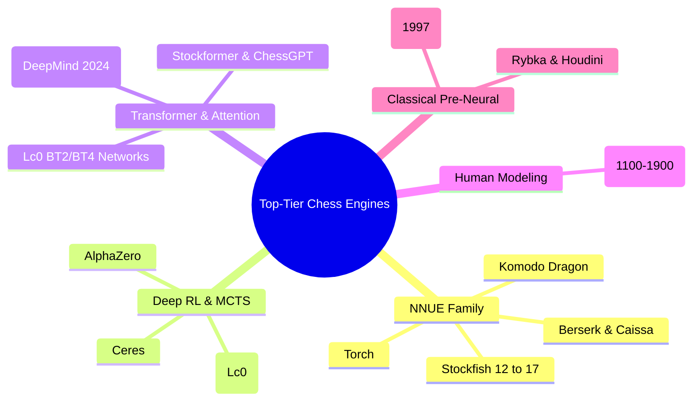

# 🏆 Complete Taxonomy of Top-Level Chess Engines

This document catalogs every significant top-tier engine, neural architecture, and search paradigm developed in computer chess history, categorizing their mathematical formulation, neural topology, search engine, and competitive performance.

---

## 1. The NNUE Powerhouses (Alpha-Beta + Incremental Quantized Nets)

### 1.1 Stockfish (Versions 12 through 17)
- **Developer**: Open Source (Marco Costalba, Joona Kiiski, Gary Linscott, Tord Romstad, SF team).
- **Peak Elo**: **~3650+ CCRL / CEGT** (Current World #1).
- **Architectural Lineage**:
  - **Stockfish 12 (Aug 2020)**: Introduced `HalfKP` ($41,024$ sparse features, 256-dim accumulator, ClippedReLU, single 16-32-1 dense net). Gained $+150$ Elo instantly.
  - **Stockfish 14 (Jul 2021)**: Migrated to `HalfKAv2` (expanded King-piece adjacent features, $>700,000$ sparse features).
  - **Stockfish 15 (Apr 2022)**: Replaced ClippedReLU with **Squared Clipped ReLU (SCReLU)**: $[\min(\max(x, 0), 127)]^2$, delivering $+20$ Elo in non-linear sensitivity.
  - **Stockfish 16 (Jun 2023)**: Introduced the **Dual-NNUE architecture**: a Small Net (~1.5 MB) for fast pruning at uncritical nodes, and a Big Net (~60 MB) for deep positional precision.
  - **Stockfish 17 (Sep 2024)**: Refined to `HalfKAv2_hm` (horizontal symmetry mirroring to reduce parameter count and increase training sample efficiency) and widened hidden accumulator layers ($2048$ dims).
- **Throughput**: 60M – 120M nodes/sec on standard multicore CPUs using AVX-512 / VNNI SIMD assembly.

### 1.2 Komodo Dragon
- **Developers**: Mark Lefler, Larry Kaufman (Commercial / Chess.com).
- **Peak Elo**: **~3580+ Elo**.
- **Key Innovation**: First major commercial engine to combine NNUE with an **optional Monte Carlo Tree Search (MCTS) mode**.
- **Strength**: Exceptional in multi-game handicap play and odds matches where human-style complications matter more than pure alpha-beta pruning cutoffs.

### 1.3 Torch
- **Developer**: Chess.com Internal Engine Team.
- **Peak Elo**: **~3600+ Elo** (Ranked #2 in world rating lists, finalist in TCEC).
- **Architecture**: Modern C++20 Alpha-Beta/PVS search paired with a specialized NNUE network trained on high-level engine tournament self-play and custom evaluation datasets.

### 1.4 Berserk, Caissa, and Ethereal
- **Open-Source TCEC Contenders**:
  - **Berserk** (Jay Honnold): Pioneered aggressive dynamic search reductions, custom WDL loss tuning, and early dual-network implementations.
  - **Caissa** (Wojciech Muła): Known for state-of-the-art SIMD vectorization and pioneering `HalfKAv2` feature variants.
  - **Ethereal** (Andrew Grant): A masterclass in clean, modular alpha-beta pruning heuristics, frequently used as the algorithmic benchmark for Late Move Reductions (LMR).

---

## 2. Deep Reinforcement Learning & MCTS (Residual CNNs)

### 2.1 DeepMind AlphaZero (2017)
- **Creators**: David Silver, Demis Hassabis, and the Google DeepMind team.
- **Estimated Elo**: **~3450 - 3500**.
- **Architecture**:
  - $8 \times 8 \times 119$ input planes (history of 8 plies + auxiliary rules).
  - 20-block Deep Residual CNN with Batch Normalization.
  - Dual heads: Policy ($\pi \in \mathbb{R}^{4096}$) and Value ($v \in [-1, +1]$).
- **Search**: Pure MCTS guided by the PUCT formula.
- **Impact**: Revolutionized computer chess aesthetic theory—demonstrated that dynamic piece activity and king marches supersede material count.

### 2.2 Leela Chess Zero (Lc0)
- **Developers**: Distributed Open-Source Community (Gary Linscott, Alexander Lyashuk, et al.).
- **Peak Elo**: **~3560+ Elo** (Multiple TCEC Superfinal Champion).
- **Architectural Evolution**:
  - **Classical Networks (T40/T60)**: Scaled from 20-block ResNets to 40 blocks, 512 channels, with **Squeeze-and-Excitation (SE)** attention units.
  - **Training Scale**: Over 1 billion games generated via distributed volunteer clients (lc0 client).
  - **Hardware Dependency**: Requires high-end GPUs (Nvidia RTX 4090, A100, H100) to evaluate ~50,000–100,000 nodes/sec via TensorRT.

### 2.3 Ceres
- **Developer**: Martin Fierz.
- **Concept**: A dedicated GPU MCTS search engine written in C#/.NET and CUDA, designed specifically to maximize the playing strength of Lc0 neural weights.
- **Innovations**: Minimax tree backups, enhanced root exploration, and non-uniform MCTS playouts.

---

## 3. Spatial Attention & Chess Transformers

### 3.1 Lc0 Attention Networks (BT2, BT3, BT4)
- **Architecture**: Replaced convolutional residual blocks with **Transformer Self-Attention layers** within the Lc0 framework.
- **Key Breakthrough**: Spatial attention naturally captures full-board diagonals and open files without needing 40 layers of convolutional receptive field expansion.

### 3.2 DeepMind "Searchless Chess" (Ruoss et al., 2024)
- **Paper**: *Grandmaster-Level Chess Without Search* (arXiv:2402.04494).
- **Peak Elo**: **2895 Blitz Elo on Lichess with 0 search nodes**.
- **Architecture**:
  - 270M-parameter decoder-only transformer (16 layers, 1024 embedding dim, 16 attention heads).
  - Trained purely on 10 million games with Stockfish 16 action-values.
  - Generates moves by taking $\arg\max_{a} Q(s, a)$ in a single forward pass without searching any future plies.

### 3.3 ChessGPT & Autoregressive Sequence Models
- **Concept**: Formulating chess as a language modeling task: predicting next moves from PGN token sequences (`1. e4 e5 2. Nf3 ...`).
- **Limitation**: While exhibiting strong opening and middlegame pattern recall, pure autoregressive language models suffer from tactical hallucinations and illegal move drift in deep endgames.

---

## 4. Human-Centric Behavioral Models

### 4.1 Maia Chess (NeurIPS 2020)
- **Authors**: Reid McIlroy-Young, Siddhartha Sen, Jon Kleinberg, Ashton Anderson (University of Toronto & Microsoft Research).
- **Core Premise**: Standard engines optimize for the *theoretically best move*. Maia optimizes to predict **what a human player will actually play**.
- **Models**:
  - `Maia 1100`, `Maia 1500`, `Maia 1900`—each trained on human games from that exact rating bracket.
- **Applications**: Human training, chess pedagogy, blunder prediction, and cheating detection.

---

## 5. Master Comparison Matrix

| Engine | Family | Primary Evaluator | Search Paradigm | Evaluation Throughput | Peak Elo |
| :--- | :--- | :--- | :--- | :--- | :--- |
| **Stockfish 17** | NNUE | Dual NNUE (`HalfKAv2_hm`) | Alpha-Beta (PVS + LMR) | 60M - 100M nps (CPU) | **3650+** |
| **Torch** | NNUE | Quantized NNUE | Alpha-Beta (PVS) | 50M - 90M nps (CPU) | ~3600 |
| **Komodo Dragon** | Hybrid | NNUE | MCTS or Alpha-Beta | 40M nps (AB) / 80k (MCTS) | ~3580 |
| **Berserk 13** | NNUE | Dual NNUE | Alpha-Beta (Aggressive LMR) | 40M - 70M nps (CPU) | ~3570 |
| **Leela (Lc0 BT4)** | Attention | Transformer / ResNet-SE | MCTS (PUCT) | 50k - 100k nps (GPU) | ~3560 |
| **AlphaZero** | Deep RL | 20-block ResNet | MCTS (PUCT) | 80k nps (TPU) | ~3450 |
| **DeepMind 2024** | Transformer| 270M Decoder Transformer| **None (0 nodes)** | 10 - 20 nps (GPU) | 2895 (Blitz) |
| **Maia 1900** | Human Model| ResNet Policy | Greedy Top-1 / PUCT | 20k nps (GPU) | ~1900 (Human) |
| **Deep Blue (1997)**| Classical | Handcrafted HW Eval | Non-uniform Minimax | 200M nps (ASIC) | ~2800 |
