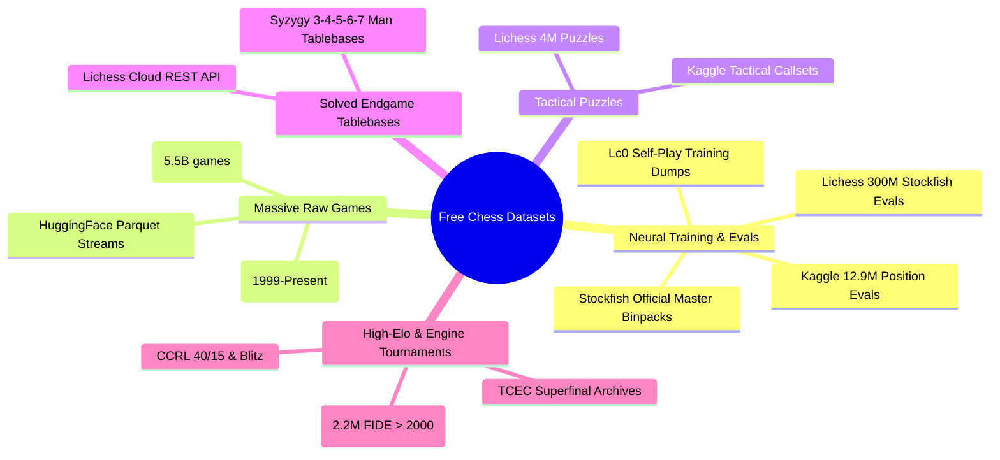

# 🌐 Free Online Chess Datasets: The Master Directory

Every major, free, public chess dataset available for training neural networks, value evaluators, policy priors, tactical puzzle solvers, and endgame systems.



---

## 1. Pre-Evaluated Position Datasets (For Value Nets & NNUE)

These datasets contain FEN positions annotated with deep engine evaluations (depth 20–50) and winning probabilities.

### 1.1 Lichess Position Evaluations (Hugging Face & Direct)
- **Scale**: Over **300 million unique FEN positions** evaluated by Stockfish 16 at depth 30–50 plies.
- **Formats**: Parquet (streamable) & `.jsonl.zst`.
- **Hugging Face**: [`Lichess/chess-position-evaluations`](https://huggingface.co/datasets/Lichess/chess-position-evaluations)
- **Direct Download**: [database.lichess.org/#evals](https://database.lichess.org/#evals)
- **Python Streaming Code**:
  ```python
  from datasets import load_dataset
  # Stream without downloading the entire dataset to disk
  dataset = load_dataset("Lichess/chess-position-evaluations", split="train", streaming=True)
  for row in dataset:
      fen = row["fen"]
      eval_cp = row["eval"]
      print(f"FEN: {fen} | Eval: {eval_cp}")
      break
  ```

### 1.2 Official Stockfish Master Binpacks
- **Maintainer**: Official Stockfish Organization.
- **Content**: Tens of billions of self-play positions generated on Fishtest. Packed in `.binpack` format with Huffman-compressed FENs and root search scores.
- **Hugging Face**:
  - Full Nets: [`official-stockfish/master-binpacks`](https://huggingface.co/datasets/official-stockfish/master-binpacks)
  - Small Nets: [`official-stockfish/master-smallnet-binpacks`](https://huggingface.co/datasets/official-stockfish/master-smallnet-binpacks)
  - Engine PGNs: [`official-stockfish/fishtest_pgns`](https://huggingface.co/datasets/official-stockfish/fishtest_pgns)
- **Use Case**: Direct training of modern NNUE networks using `nnue-pytorch`.

### 1.3 Kaggle 12.9M Chess Evaluations
- **Author**: Ronak Badhe.
- **Scale**: 12.9 million FEN positions evaluated by Stockfish at depth 18.
- **Link**: [kaggle.com/datasets/ronakbadhe/chess-evaluations](https://www.kaggle.com/datasets/ronakbadhe/chess-evaluations)
- **Format**: CSV (`fen, sub_eval`). Lightweight and easy to import into pandas/NumPy.

### 1.4 Leela Chess Zero (Lc0) Distributed Self-Play Dumps
- **Scale**: Hundreds of millions of games from runs T60, T70, T80, and BT2/BT4.
- **Content**: Contains MCTS root visit distributions, policy probabilities, and game outcomes.
- **Direct Portal**: [training.lczero.org](https://training.lczero.org/)
- **Use Case**: Training policy-value ResNets and Transformers.

---

## 2. Massive Raw Game Databases (For Policy Priors & Pre-training)

### 2.1 Lichess Standard Rated Games
- **Scale**: **5.5+ billion games** recorded since 2013, updated monthly (~100M new games/month).
- **Format**: `.pgn.zst` and Parquet.
- **Direct Archive**: [database.lichess.org](https://database.lichess.org/)
- **Hugging Face Streamable**: [`Lichess/standard-chess-games`](https://huggingface.co/datasets/Lichess/standard-chess-games)
- **Attributes**: WhiteElo, BlackElo, Result, Clock times, Time control, PGN moves, evaluation comments.

### 2.2 FICS Games Database (Free Internet Chess Server)
- **Scale**: Over **300 million online games** from 1999 to the present.
- **Format**: Monthly downloadable `.pgn.bz2` or `.zip`.
- **Link**: [ficsgames.org](https://www.ficsgames.org/)
- **Strength**: Long historical coverage spanning 25+ years.

---

## 3. High-Elo & Engine Tournament Corpora (Top-Tier Quality)

To prevent models from learning human blunders, engine and Grandmaster games provide the highest signal-to-noise ratio:

### 3.1 Computer Chess Rating Lists (CCRL)
- **Scale**: Over **4 million engine-vs-engine games** played at tournament time controls (40/15, 40/2, blitz).
- **Features**: Moves, clock evaluations, and engine search depth annotations for Stockfish, Komodo, Leela, Berserk, etc.
- **Link**: [computerchess.org.uk/ccrl](https://www.computerchess.org.uk/ccrl/)

### 3.2 Top Chess Engine Championship (TCEC) Game Archives
- **Content**: The gold standard of computer chess. Superfinals, Premier Division games played on dual 128-core servers.
- **Link**: [tcec-chess.com/archive.html](https://tcec-chess.com/archive.html)

### 3.3 KingBase 2019 / KingBase Lite
- **Scale**: **2.2 million classical master games** played by players rated FIDE $\ge 2000$ from 1990 to present.
- **Link**: [kingbase-chess.net](https://www.kingbase-chess.net/)
- **Format**: Clean PGN, no duplicates, filtered by FIDE master strength.

### 3.4 PGN Mentor Master Archives
- **Content**: Curated PGN collections categorized by Grandmaster (Kasparov, Carlsen, Fischer, Tal) and by ECO Opening code.
- **Link**: [pgnmentor.com/files.html](https://www.pgnmentor.com/files.html)

---

## 4. Tactical Puzzles & Benchmark Suites

### 4.1 Lichess Curated Puzzles (4M+ Puzzles)
- **Scale**: Over **4 million tactical puzzles** rated with Glicko-2, categorized by theme (fork, pin, skewer, discoveredAttack, mateIn2, mateIn3, etc.).
- **Formats**: CSV (`.csv.zst`) and Parquet.
- **Hugging Face**: [`Lichess/chess-puzzles`](https://huggingface.co/datasets/Lichess/chess-puzzles)
- **Direct Download**: [database.lichess.org/#puzzles](https://database.lichess.org/#puzzles)
- **Schema**:
  ```csv
  PuzzleId,FEN,Moves,Rating,RatingDeviation,Popularity,NbPlays,Themes,GameUrl,OpeningTags
  ```

---

## 5. Mathematically Solved Endgame Tablebases (Syzygy)

Every position with $\le 7$ pieces is completely solved.

### 5.1 Syzygy Tables
| Pieces | Total File Size | Description | Download |
| :--- | :--- | :--- | :--- |
| **3-4-5 Man** | **~1 GB** | Essential for all engines | [Direct HTTP Mirror](https://tablebase.lichess.ovh/tables/standard/) |
| **6-Man** | **~150 GB** | Master-level endgame play | [Free Torrents / HTTP](https://tablebase.lichess.ovh/tables/standard/) |
| **7-Man** | **~17.5 TB** | Perfect 7-piece play | Free community torrents |

### 5.2 Free Cloud Syzygy REST API (Zero Disk Space Needed!)
Lichess provides a free, instant cloud API to probe Syzygy 7-man tablebases:
```bash
curl -s "https://tablebase.lichess.ovh/standard?fen=8/8/4k3/8/8/8/4R3/4K3_w_-_-_0_1"
```
Response:
```json
{
  "checkmate": false,
  "stalemate": false,
  "variant_win": false,
  "variant_loss": false,
  "insufficient_material": false,
  "wdl": 2,
  "dtz": 1,
  "moves": [{"uci": "e1f2", "wdl": 2, "dtz": 2}]
}
```

---

## 6. Quick Download & Preprocessing Script

Use this Python script to stream, download, or convert free datasets directly:

```python
# Install prerequisites: pip install datasets zstandard chess
from datasets import load_dataset

def stream_lichess_evaluations(limit=1000):
    print(f"Streaming {limit} positions from Hugging Face...")
    ds = load_dataset("Lichess/chess-position-evaluations", split="train", streaming=True)
    count = 0
    for item in ds:
        fen = item["fen"]
        cp = item["eval"]
        print(f"[{count+1}] FEN: {fen} => Eval: {cp} cp")
        count += 1
        if count >= limit:
            break

if __name__ == "__main__":
    stream_lichess_evaluations(10)
```
