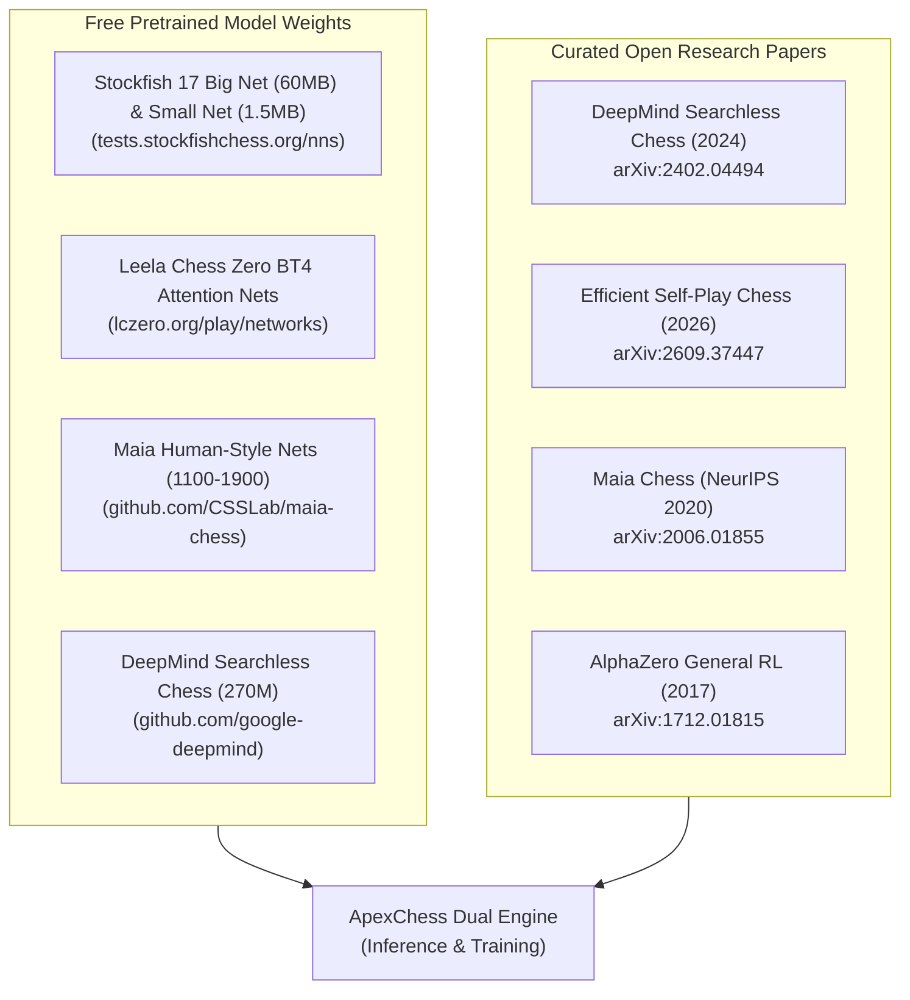

# 📦 Pretrained Model Weights & Research Paper Archives

Yes, **almost all cutting-edge, superhuman chess engine model weights and academic research papers are 100% free and open-source**.

This document indexes direct download locations for the world's strongest neural network weights, explains how to extract embedded weights directly from engine binaries, and reviews the latest breakthrough papers from arXiv, DeepMind, and NeurIPS.



---

## 1. Where to Download Pretrained Model Weights (100% Free)

### 1.1 Official Stockfish NNUE Weights
Every neural network ever used by Stockfish in official competition is archived and freely downloadable.

| Network | Filename | Size | Architecture | Direct Download Link |
| :--- | :--- | :--- | :--- | :--- |
| **Stockfish 17 Big Net** | `nn-b1a57edbea57.nnue` | **~60 MB** | `HalfKAv2_hm` (2048 dims) | [Download Net](https://tests.stockfishchess.org/api/nn/nn-b1a57edbea57.nnue) |
| **Stockfish 17 Small Net** | `nn-baff1ede1f0f.nnue` | **~1.5 MB** | `HalfKAv2_hm` (512 dims) | [Download Net](https://tests.stockfishchess.org/api/nn/nn-baff1ede1f0f.nnue) |
| **Stockfish 16 Default** | `nn-e8bac1c074c4.nnue` | **~45 MB** | `HalfKAv2` (1024 dims) | [Download Net](https://tests.stockfishchess.org/api/nn/nn-e8bac1c074c4.nnue) |
| **Full Stockfish Archive** | All Historical Nets | Various | `HalfKP` & `HalfKA` | [Stockfish NN Archive](https://tests.stockfishchess.org/nns) |

> [!TIP]
> **Extracting Weights from any Stockfish Binary**:
> You don't even need to download them separately if you have a Stockfish binary. Simply launch Stockfish in your terminal and type:
> ```
> export_net my_weights.nnue
> ```
> Stockfish will immediately dump its embedded neural network weights to disk!

---

### 1.2 Leela Chess Zero (Lc0) Pretrained Networks
Lc0 networks come in multiple topologies (ResNets and Transformers) in `.pb.gz` (Protobuf) and `.onnx` formats:

- **Best Networks Portal**: [lczero.org/play/networks/bestnets/](https://lczero.org/play/networks/bestnets/)
- **Complete Run Catalog**: [training.lczero.org/networks](https://training.lczero.org/networks)
- **Top Transformer Series (BT4)**:
  - 24-layer Transformer self-attention networks trained across hundreds of millions of games.
  - Compatible with TensorRT, ONNX Runtime, and the Lc0 engine.

---

### 1.3 Maia Chess (Human Modeling Weights)
- **GitHub Repository**: [github.com/CSSLab/maia-chess](https://github.com/CSSLab/maia-chess)
- **Available Models**:
  - `maia-1100.pb.gz`: Predicts 1100-rated human moves.
  - `maia-1500.pb.gz`: Predicts 1500-rated human moves.
  - `maia-1900.pb.gz`: Predicts 1900-rated human moves.

---

### 1.4 DeepMind Searchless Chess
- **Open Code & Models**: [github.com/google-deepmind/searchless_chess](https://github.com/google-deepmind/searchless_chess)
- **ChessBench Dataset**: 10 million games annotated with Stockfish 16 action-values (15 billion data points) on Hugging Face.

---

## 2. Deep Dive: Cutting-Edge Research Papers on arXiv

### Paper 1: Amortized Planning with Large-Scale Transformers (DeepMind, Feb 2024)
- **Authors**: Anian Ruoss, Grégoire Delétang, Sourabh Medapati, Jordi Grau-Moya, Li Kevin Wenliang, Elliot Catt, John Reid, Tim Genewein (Google DeepMind).
- **arXiv ID**: [`arXiv:2402.04494`](https://arxiv.org/abs/2402.04494)
- **PDF URL**: [https://arxiv.org/pdf/2402.04494.pdf](https://arxiv.org/pdf/2402.04494.pdf)
- **Key Breakthrough**:
  - Investigates whether a high-capacity transformer can **amortize tree search** (internalize lookahead within feed-forward weights).
  - A 270M-parameter transformer trained on 10 million games (ChessBench) achieved **2895 Blitz Elo on Lichess with zero search nodes**.
  - **Limitation**: While it solves Grandmaster-level puzzles, it still suffers from subtle horizon effects in 15+ ply forced tactical variations, proving that search cannot be completely eliminated.

---

### Paper 2: Engineering Efficient Self-Play Chess: Search, Replay, and Throughput Under Limited Compute (Sep 2026)
- **arXiv ID**: [`arXiv:2609.37447`](https://arxiv.org/abs/2609.37447)
- **PDF URL**: [https://arxiv.org/pdf/2609.37447.pdf](https://arxiv.org/pdf/2609.37447.pdf)
- **Key Breakthrough**:
  - Addresses the "compute barrier" of AlphaZero (which originally required thousands of TPUs).
  - Trains an AlphaZero-style model from scratch on a **single 8-GPU node in just 2.5 days**, achieving **3,251 Elo** against Stockfish 13.
  - Core techniques: Progressive model resizing (starting with a tiny 4-block network and expanding), prioritized restart-state replay buffers, and 8-bit quantized inference during self-play generation.

---

### Paper 3: Aligning Superhuman AI with Human Behavior: Chess as a Model System (NeurIPS 2020)
- **Authors**: Reid McIlroy-Young, Siddhartha Sen, Jon Kleinberg, Ashton Anderson.
- **arXiv ID**: [`arXiv:2006.01855`](https://arxiv.org/abs/2006.01855)
- **PDF URL**: [https://arxiv.org/pdf/2006.01855.pdf](https://arxiv.org/pdf/2006.01855.pdf)
- **Key Breakthrough**:
  - Proves that superhuman engines make poor human tutors because their moves look like alien precision.
  - By training customized policy networks on discretized human rating brackets, Maia predicts human moves and human blunders with $>52\%$ exact move accuracy.

---

### Paper 4: Mastering Chess and Shogi by Self-Play with a General Reinforcement Learning Algorithm (DeepMind 2017)
- **Authors**: David Silver et al. (Google DeepMind).
- **arXiv ID**: [`arXiv:1712.01815`](https://arxiv.org/abs/1712.01815) / *Science (2018)*.
- **PDF URL**: [https://arxiv.org/pdf/1712.01815.pdf](https://arxiv.org/pdf/1712.01815.pdf)
- **Key Breakthrough**:
  - The foundation of modern neural game AI: tabula rasa self-play, PUCT Monte Carlo Tree Search, and dual-head policy/value optimization.

---

## 3. Automated Downloader Tool in Your Repository

You can automatically download these weights and research papers into your local project using the downloader script:

```bash
# Download both research papers and model weights
python scripts/download_resources.py all

# Or download only research paper PDFs:
python scripts/download_resources.py papers

# Or download only neural weights:
python scripts/download_resources.py weights
```

This downloads:
1. `models/sf17_small.nnue` (~1.5 MB)
2. `models/sf17_big.nnue` (~60 MB)
3. `papers/deepmind_searchless_chess_2402.04494.pdf`
4. `papers/efficient_selfplay_2609.37447.pdf`
5. `papers/alphazero_1712.01815.pdf`
6. `papers/maia_chess_2006.01855.pdf`
