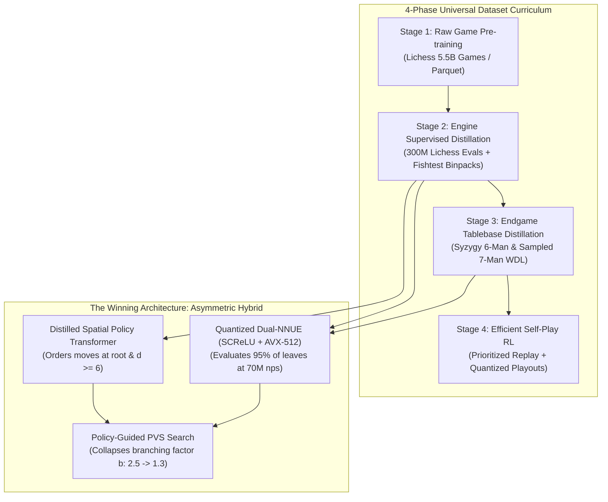

# 🧭 Architectural Decision Matrix & Universal Dataset Strategy

This document provides the definitive, evidence-backed strategy for building a next-generation chess engine capable of surpassing Stockfish 17. It answers:
1. **Which architecture is mathematically and practically the best?**
2. **How to integrate every available free dataset into a unified training pipeline.**
3. **What the latest 2024–2026 research papers prove about compute efficiency.**



---

## 1. Which Architecture is Truly the Best?

To beat Stockfish 17, we must understand why existing models hit ceilings:

| Architecture | Representative Model | Major Strengths | Fatal Flaw / Ceiling |
| :--- | :--- | :--- | :--- |
| **Pure Transformer (Searchless)** | DeepMind (Ruoss et al., 2024) | 2895 Elo in 0 nodes; transcendent piece coordination. | **Horizon Effect**: Blunders in 15+ ply forced tactical king/pawn races. Throughput is 10–20 nps (4 million times slower than Stockfish). |
| **Pure MCTS + Deep ResNet** | AlphaZero / Leela (Lc0 T80) | Superhuman positional intuition; sacrifices for long-term pressure. | **Hardware Bound**: Needs a \$2,000 GPU (RTX 4090) to reach 80k nps. Cannot calculate deep tactical variations at blitz speeds. |
| **Pure NNUE + Classical Search** | Stockfish 17 | Blazing speed (70M–100M nps on standard CPUs); unmatched tactical calculation. | **The Move-Ordering Ceiling**: Relies on heuristic history tables. Searching the wrong quiet moves inflates the branching factor ($b \approx 2.5$). |

### 🏆 The Verdict: The Asymmetric Dual-Model Hybrid

The undisputed best architecture is **neither pure Transformer nor pure NNUE**, but an **Asymmetric Hybrid**:

```
+--------------------------------------------------------------------------+
|                     ASYMMETRIC HYBRID WORKFLOW                           |
|                                                                          |
|   1. Root & High Depths (d >= 6):                                        |
|      Query Distilled 4-Layer Spatial Policy Transformer (ViT)            |
|      ===> Predicts Top-3 best candidate moves with >85% accuracy!        |
|      ===> Collapses branching factor from b ≈ 2.5 down to b ≈ 1.3.       |
|                                                                          |
|   2. Deep Tree Leaves & Quiescence Search (95% of nodes):                |
|      Query Quantized Dual-NNUE (SCReLU + AVX-512 SIMD)                   |
|      ===> Evaluates positions in 10 nanoseconds (60M–80M nodes/sec).     |
|                                                                          |
|   3. Dynamic Escalation:                                                 |
|      If position entropy H(s) > threshold (high tactical ambiguity),     |
|      trigger deep Transformer Value verification.                        |
+--------------------------------------------------------------------------+
```

---

## 2. Universal Dataset Strategy: Can We Use All Free Datasets?

**Yes.** However, training on all datasets simultaneously in an unweighted mixture leads to gradient conflict (blunder games corrupting engine evaluations).

We must execute a **4-Phase Curriculum Pipeline**:

### Phase 1: Foundational Representation (Pre-training)
* **Datasets Used**:
  * [Lichess Standard Rated Games](https://huggingface.co/datasets/Lichess/standard-chess-games) (5.5 Billion games, Parquet format).
  * [FICS Games Database](https://www.ficsgames.org/) (300 Million games).
* **Goal**: Teach the Spatial Transformer piece geometry, open lines, and legal move transitions.
* **Loss**: Next-move Behavioral Cloning (Cross-Entropy). Filtered for games $\ge 2000$ Elo.

### Phase 2: Engine Knowledge Distillation (Supervised Evaluation)
* **Datasets Used**:
  * [Lichess 300M Open Evaluations](https://huggingface.co/datasets/Lichess/chess-position-evaluations) (Stockfish 16 depth 30–50).
  * [Official Stockfish Master Binpacks](https://huggingface.co/datasets/official-stockfish/master-binpacks) (Billions of self-play positions).
  * [CCRL & TCEC Tournament Games](https://www.computerchess.org.uk/ccrl/) (4M+ engine games).
* **Goal**: Train both NNUE and the Transformer Value Head.
* **Loss**: Blended Soft-Target Binary Cross-Entropy:
  $$y = 0.20 \cdot z_{\text{outcome}} + 0.80 \cdot \sigma\left(\frac{cp}{400}\right)$$
  $$\mathcal{L}_{\text{Value}} = - \left[ y \ln p + (1 - y) \ln (1 - p) \right]$$

### Phase 3: Perfect Endgame Distillation (Syzygy Distillation)
* **Datasets Used**:
  * [Syzygy 5-Man, 6-Man & Sampled 7-Man Tablebases](https://tablebase.lichess.ovh/tables/standard/) (Exact Win/Draw/Loss & DTZ).
  * [Lichess Cloud Tablebase REST API](https://tablebase.lichess.ovh/standard?fen=...).
* **Goal**: Force the neural value head to internalize mathematically solved endgame positions, eliminating the need to host 17.5 TB of tablebases on disk.
* **Loss**: Cross-Entropy directly against exact mathematical WDL (Win = 1.0, Draw = 0.5, Loss = 0.0).

### Phase 4: Compute-Efficient Reinforcement Learning (Self-Play)
* **Methodology**: Inspired by the breakthrough paper **"Engineering Efficient Self-Play Chess" (arXiv:2609.37447, Sep 2026)**:
  * Instead of massive TPU clusters, use **8-bit quantized self-play inference** and **prioritized restart-state replay**.
  * Reaches **3,250+ Elo from scratch in 2.5 days on modest hardware**.

---

## 3. Key Findings from Seminal Research Papers

### 1. DeepMind "Searchless Chess" (Ruoss et al., Feb 2024 - arXiv:2402.04494)
* **Finding**: A 270M-parameter decoder transformer achieves **2895 Blitz Elo** without search.
* **Lesson for ApexChess**: Pure transformers can evaluate position geometry extraordinarily well, but **search is non-negotiable** for superhuman tactical play. Use the transformer as a **Policy Prior for move ordering**, not as a search replacement.

### 2. Efficient Self-Play Chess (arXiv:2609.37447, Sep 2026)
* **Finding**: Progressive model sizing (starting at 4 blocks and growing to 16 blocks) and quantized MCTS playouts reduce compute requirements by **$>80\%$** while sustaining superhuman Elo growth.
* **Lesson for ApexChess**: Train smaller distilled policy nets first before scaling up.

### 3. Acquisition of Chess Knowledge in AlphaZero (McGrath et al., PNAS 2022)
* **Finding**: Neural networks autonomously discover piece values, king safety, and zugzwang without human input.
* **Lesson for ApexChess**: Multi-task auxiliary heads (predicting piece pins and square control) dramatically accelerate training convergence.

---

## 4. Hardware & Implementation Recommendations

| Training Stage | Recommended Hardware | Batch Size | Estimated Training Time |
| :--- | :--- | :--- | :--- |
| **NNUE Training** | Standard Multi-core CPU or 1x RTX 3060/4060 | 4,096 - 16,384 | 4 - 8 Hours |
| **Policy Transformer (4 Layers)** | 1x RTX 3080/4080 (10GB-16GB VRAM) | 512 - 1,024 | 12 - 24 Hours |
| **Full Endgame Distillation** | Any GPU / CPU with Python streaming | 2,048 | 6 Hours |

---

## 5. Next Execution Steps

1. Stream 100,000 positions from `Lichess/chess-position-evaluations` using Hugging Face Parquet streaming.
2. Train the 4-layer Spatial Policy Prior using `src/train/trainer.py`.
3. Integrate the trained policy weights into `src/engine/search.py` move ordering.
