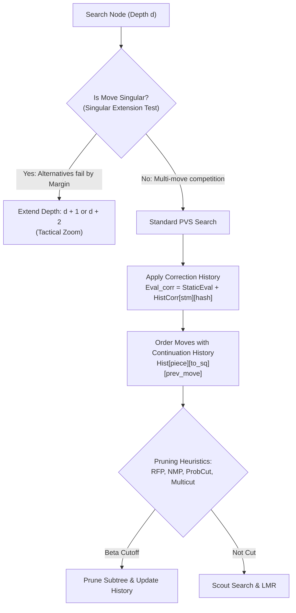

# ⚡ Advanced Alpha-Beta Pruning, Extensions, and Dynamic History

While textbook Alpha-Beta search introduces basic $[\alpha, \beta]$ branch cutting, **modern superhuman search engines (Stockfish 16/17, Torch, Berserk)** operate on an intricate web of dynamic extensions, multi-dimensional history heuristics, and statistical evaluation corrections.



---

## 1. Singular Extensions (The Tactical Zoom Function)

Singular Extensions are responsible for more Elo gain than almost any other search feature in modern chess programming (+40 to +60 Elo).

### 1.1 The Theoretical Problem
In complex tactical positions, standard Alpha-Beta can fall victim to the **Horizon Effect**:
If the only winning move (or only saving defensive move) is 1 ply beyond the current search depth limit, the engine will blunder because it treats all candidate moves as roughly equivalent.

### 1.2 The Singularity Test
When the search reaches a node at depth $d \ge 8$:
1. Identify the **TT Move** (the best move recorded in the Transposition Table from previous iterative deepening passes).
2. Establish a **Singular Beta**:
   $$\beta_{\text{singular}} = \text{Score}_{\text{TT}} - \text{Margin}(d)$$
   Where $\text{Margin}(d) = c_1 \cdot d$ (typically $2 \times d$ or $3 \times d$ centipawns, around $1.0\text{ pawn}$).
3. **Execute Reduced Search**: Search the position at depth $d/2$ (or $d - 3$), **excluding the TT Move**.
4. **Evaluate Result**:
   - If the score of all other moves is $< \beta_{\text{singular}}$, it proves mathematically that the TT move is **singular** (head-and-shoulders above all alternatives; no other move even comes close).
   - **The Action**: Extend the search of this singular move by **$+1$ ply** (or **$+2$ plies** if the margin was massive).
   - If another move scores $\ge \beta_{\text{singular}}$, the move is **non-singular** (multiple viable alternatives exist), and no extension is granted.

```c
// Pseudo-code implementation of Singular Extension Test
if (depth >= 8 && move == ttMove && abs(ttScore) < MATE_SCORE) {
    int singularBeta = ttScore - 2 * depth;
    int singularDepth = (depth - 1) / 2;
    
    // Search all moves EXCEPT ttMove
    int score = search(board, singularDepth, singularBeta - 1, singularBeta, cutNode, /* excludeMove = */ ttMove);
    
    if (score < singularBeta) {
        extension = 1; // Singular move confirmed!
        if (!isPV && score < singularBeta - 20) {
            extension = 2; // Double extension for extreme dominance
        }
    }
}
```

---

## 2. Multi-Dimensional History Heuristics

Traditional engines used a flat 2D **Butterfly History Table** `History[from_square][to_square]`. Modern engines maintain a hierarchy of contextual tables:

### 2.1 Continuation History Table
Moves do not occur in a vacuum; a move's strength is intimately tied to the move played immediately prior.
- **Structure**: `ContinuationHistory[piece][to_square][previous_piece][previous_to_square]`
- Stores the statistical success rate of playing `(piece, to_square)` as a direct follow-up or reply to the opponent's previous move.
- Typically tracks continuation at:
  - $1$ ply ago (direct reply)
  - $2$ plies ago (follow-up to friendly previous move)
  - $4$ plies ago (strategic continuation)

### 2.2 Capture History Table
Standard history tables historically tracked only quiet moves (because captures were sorted by MVV-LVA).
Modern engines track **Capture History**:
- Captures are ordered not just by piece values, but by historical cutoff success in similar pawn structures.

---

## 3. Correction History (Online Evaluation Calibration)

Introduced in Stockfish 15/16, **Correction History** allows the search engine to *correct* errors in the neural evaluation without modifying the NNUE weights.

### 3.1 The Mechanism
1. At any node, compute the static NNUE score: $E_{\text{static}}$.
2. After searching the subtree to completion, record the final search score: $S_{\text{search}}$.
3. Compute the evaluation error:
   $$\Delta = S_{\text{search}} - E_{\text{static}}$$
4. Update the **Correction History Table** indexed by pawn structure hash and side to move:
   $$\text{CorrHist}[\text{stm}][\text{PawnHash}] \leftarrow (1 - \alpha) \cdot \text{CorrHist} + \alpha \cdot \Delta$$
5. In future visits to positions with identical pawn structures, the static evaluation is immediately adjusted:
   $$E_{\text{adjusted}} = E_{\text{static}} + \text{CorrHist}[\text{stm}][\text{PawnHash}]$$

This eliminates persistent evaluation blind spots in specific pawn structures without expensive backpropagation!

---

## 4. Aggressive Pruning: ProbCut & Multicut

### 4.1 ProbCut (Probabilistic Cut)
Invented by Michael Buro: If a shallow search with a large margin strongly suggests that the true score will exceed $\beta$, we can prune the node with statistical confidence.
- At depth $d \ge 5$, search capture moves with a reduced depth ($d - 4$) and a stretched window $[\beta + M, \infty]$.
- If a capture beats $\beta + M$, assume the node would have failed high at full depth and prune immediately.

### 4.2 Multicut
- If in a node where we expect to fail low, **several independent moves ($M \ge 3$)** unexpectedly beat $\beta$ in a shallow search, we can deduce that the position is overwhelmingly winning and cut off the search without searching the rest of the branch.

---

## 5. Dynamic Time Management

A grandmaster does not spend the same time on every move; neither does a superhuman engine.

$$\text{TimeAllocated} = \text{BaseTime} \times \text{InstabilityFactor} \times \text{BestMoveChangesFactor}$$

1. **Node Instability**: If the top move flips during iterative deepening iterations (e.g. Iteration 12 liked $e4$, but Iteration 14 prefers $d4$), time is multiplied by $1.5\times - 2.5\times$.
2. **Score Drop Panic**: If the evaluation drops by $>50$ cp between iterations, the engine extends its time budget to find a defensive resource.
3. **Forced Move Optimization**: If there is only 1 legal move, allocate **0.001 seconds** and play instantly!
