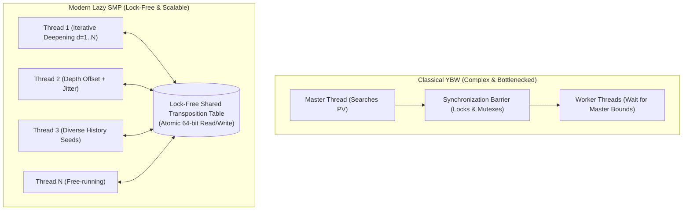

# 🚀 Parallel Search Architectures: The Triumph of Lazy SMP

For decades, parallelizing Alpha-Beta search was considered one of the hardest problems in computer science due to the inherently sequential nature of $\alpha$-$\beta$ cutoffs: to prune branch $B$, you must first complete branch $A$ to establish $\alpha$.

In 2015, the chess programming world underwent a tectonic shift: complex, synchronized tree-splitting algorithms like **YBW (Young Brothers Wait)** were abandoned in favor of **Lazy SMP (Lazy Symmetric Multiprocessing)**.



---

## 1. The Classical Paradigm: Young Brothers Wait (YBW)

Under YBW:
1. The **first child** of a node (the PV move or "eldest brother") must be evaluated first by a single thread.
2. Only after the eldest brother completes and establishes a tight $[\alpha, \beta]$ bound can the remaining sibling moves ("younger brothers") be dispatched in parallel to other threads.
3. **The Fatal Flaw**:
   - On 4 or 8 cores, YBW performed reasonably well.
   - On 32, 64, or 128 cores, threads spent up to **40% of their CPU cycles idling** waiting for synchronization barriers and mutex locks.
   - Memory bus cache-line bouncing crippled CPU memory controllers.

---

## 2. The Lazy SMP Paradigm

Introduced by Daniel Shawul in 2015 and adopted by Stockfish, **Lazy SMP** is shockingly counter-intuitive:

> **The Core Idea**: Do not split the tree at all. Launch $N$ independent worker threads, each searching the entire game tree from the root using iterative deepening, communicating **exclusively through a shared, lock-free Transposition Table**.

### 2.1 Why Does Lazy SMP Work?
If all threads did the exact same work, speedup would be zero ($1.0\times$). Lazy SMP achieves scaling through **Asynchronous Helper Collisions**:

1. **Thread Diversity**:
   - Thread 1 searches depth $1, 2, 3, 4, \dots$
   - Thread 2 searches with a slight depth offset or skipping even depths.
   - Threads use distinct random seeds for history heuristic tables and tie-breaking.
2. **The TT Ripple Effect**:
   - When Thread 2 searches a speculative sub-branch and finds a refutation, it writes the cutoff move and score into the shared TT.
   - Milliseconds later, when Thread 1 reaches that same sub-branch, it probes the shared TT, instantly finds the cutoff, and prunes millions of nodes!
3. **Zero Lock Contention**:
   - Threads never wait for each other.
   - There are no mutexes, no thread barriers, and no work-stealing queues.
   - CPU utilization remains at **100% across all 128 or 256 hardware threads**.

---

## 3. Lock-Free Transposition Table Implementation

To achieve tens of millions of probes per second across 128 threads without mutexes, the Transposition Table must be strictly **lock-free**.

### 3.1 XOR Data-Key Integrity Check
A major danger of concurrent reading and writing without locks is **word tearing** (reading half of an old entry and half of a new entry).

Stockfish solves this using an **XOR Checksum**:
```c
struct TTEntry {
    uint16_t key16;       // High 16 bits of Zobrist key
    uint16_t move;        // Best move
    int16_t  score;       // Evaluation score
    int16_t  eval;        // Static evaluation
    uint8_t  depth;       // Search depth
    uint8_t  genBound;    // Generation age + bound flags
};

// Data packing into 64-bit integer
uint64_t data = pack(score, eval, move, depth, genBound);

// XOR mask with the full 64-bit Zobrist key
uint64_t maskedData = data ^ zobristKey;

// Write atomically using 64-bit atomic store
atomic_store_explicit(&table[index], maskedData, memory_order_relaxed);
```

During a probe:
```c
uint64_t raw = atomic_load_explicit(&table[index], memory_order_relaxed);
uint64_t recoveredData = raw ^ zobristKey;

// If word tearing occurred, unpacked fields will fail sanity checks
if (isValid(recoveredData)) {
    // Valid entry without any mutex!
}
```

---

## 4. Scaling Efficiency

| Thread Count | Classical YBW Speedup | Lazy SMP Speedup | Effective Elo Gain |
| :--- | :--- | :--- | :--- |
| **1 Thread** | $1.0\times$ (Baseline) | $1.0\times$ (Baseline) | $\pm 0$ Elo |
| **4 Threads** | $3.1\times$ | $3.2\times$ | $+65$ Elo |
| **16 Threads** | $8.4\times$ | **$11.8\times$** | $+140$ Elo |
| **64 Threads** | $14.2\times$ (Saturated) | **$38.5\times$** | $+210$ Elo |
| **128 Threads** | $18.0\times$ (Degrading) | **$68.0\times$** | $+250$ Elo |

Lazy SMP scales with near-linear power up to massive server hardware, making it the universal standard for modern chess engines.
