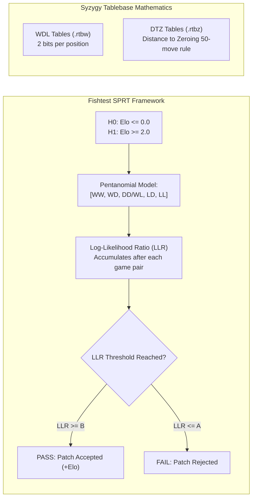

# 📊 Testing Methodology: SPRT, Fishtest & Syzygy Tablebases

Building a superhuman engine requires scientific empirical verification: how do we know if a +0.5 Elo code change is statistically significant, and how do Syzygy tablebases compress 17.5 TB of endgame solutions into lightning-fast runtime probes?

---

## 1. The Mathematics of SPRT (Sequential Probability Ratio Test)

In chess programming, playing a fixed match (e.g. 1,000 games) is inefficient:
- A disastrously bad patch takes 1,000 games to fail when it could have been rejected after 50 games.
- A subtle +1.5 Elo improvement might need 50,000 games to achieve $p < 0.05$ significance.

### 1.1 Wald's Sequential Probability Ratio Test
Fishtest uses **Wald's SPRT**:
We test two competing hypotheses:
- $H_0: \text{Elo} \le \text{Elo}_0$ (Default: $\text{Elo}_0 = 0.0$)
- $H_1: \text{Elo} \ge \text{Elo}_1$ (Default: $\text{Elo}_1 = 2.0$)

With type-I error rate $\alpha = 0.05$ and type-II error rate $\beta = 0.05$.

After each game result $x$, the **Log-Likelihood Ratio (LLR)** is updated:
$$\text{LLR}_N = \sum_{i=1}^N \ln \left( \frac{P(x_i \mid H_1)}{P(x_i \mid H_0)} \right)$$

### 1.2 Stopping Boundaries
Search continues until $\text{LLR}$ crosses one of two thresholds:
$$B = \ln\left(\frac{1 - \beta}{\alpha}\right) \approx \ln\left(\frac{0.95}{0.05}\right) = +2.944$$
$$A = \ln\left(\frac{\beta}{1 - \alpha}\right) \approx \ln\left(\frac{0.05}{0.95}\right) = -2.944$$

- If $\text{LLR} \ge +2.944$: **Stop & Accept (PASS)**.
- If $\text{LLR} \le -2.944$: **Stop & Reject (FAIL)**.

### 1.3 The Pentanomial Model
Because chess games are played in pairs (Engine A as White / Engine B as Black, then reversed with the same opening), games are correlated. Fishtest models outcomes as a **5-state categorical distribution (Pentanomial)**:
1. State 0: Loss-Loss (0.0 points)
2. State 1: Loss-Draw (0.5 points)
3. State 2: Draw-Draw or Win-Loss (1.0 points)
4. State 3: Win-Draw (1.5 points)
5. State 4: Win-Win (2.0 points)

---

## 2. Opening Books for Testing: UHO & DFRC

If two 3600-Elo engines play from the starting position, $>95\%$ of games end in draws, yielding almost zero statistical information.

### 2.1 UHO (Ultra-High Opening Books)
Engines are tested using **UHO books** (e.g. `UHO_Lichess_4852_v1.epd`):
- Positions chosen specifically at ply 8–12 where the evaluation is between $+0.50$ and $+1.20$ pawns.
- Both engines play both sides of the imbalance. The engine that defends the inferior side better and converts the superior side more reliably wins the match.

---

## 3. Syzygy Tablebase Internal Mechanics

Why did Ronald de Man's **Syzygy Tablebases** replace Nalimov tablebases?

### 3.1 DTM vs DTZ: The 17.5 TB Miracle
- **Nalimov Tablebases (DTM - Distance to Mate)**:
  - Must calculate the exact number of plies to checkmate across the entire game.
  - A 7-man DTM tablebase requires over **140 Terabytes** because mate paths span hundreds of plies.
- **Syzygy Tablebases (DTZ - Distance to Zero)**:
  - DTZ does not care about checkmate; it calculates distance to the **next pawn move or capture** that resets the 50-move rule counter!
  - Once a pawn moves or a piece is captured, the position transitions into an already-solved sub-tablebase (e.g. 7-man becomes 6-man).
  - This recursive reduction allows compressing 7-man tables down to **17.5 TB**, and 6-man tables to **150 GB**.

### 3.2 Dual-File Structure
1. `.rtbw` (Tablebase Win/Draw/Loss):
   - Stores only 2 bits per position: Loss (-1), Draw (0), Win (+1), or Blessed Loss / Cursed Win (due to 50-move rule).
   - Queried at search tree leaves.
2. `.rtbz` (Tablebase Distance to Zero):
   - Stores exact DTZ values.
   - Queried **only at the root node** to pick the specific move that preserves the win.

---

## 4. Optimal Tablebase Probe Timing in Alpha-Beta

Probing tablebases on NVMe SSDs has an I/O cost of $\sim 5-20\ \mu\text{s}$. Blindly probing on every node will cripple an engine's throughput from 80M nps down to 50k nps!

### The Golden Probing Rules:
1. **Root Node**: Always probe WDL and DTZ. If position is a known win, execute the winning DTZ move instantly.
2. **Search Depth $d \ge 2$**: Probe `.rtbw` only if remaining pieces on board $\le \text{MaxTablebasePieces}$.
3. **Quiescence Search**: **Never probe tablebases** in quiescence search (too many leaf nodes; cost of disk probe exceeds tactical search cost).
