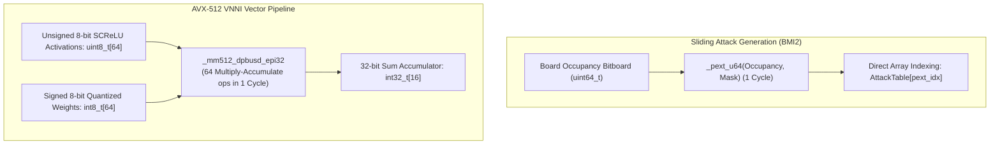

# ⚙️ Low-Bit Quantization & SIMD Micro-Architecture

In modern computer chess, algorithm design cannot be divorced from CPU micro-architecture. An algorithm that takes $100$ instructions in pure Python or unvectorized C++ can be executed in **1 single clock cycle** using modern SIMD (Single Instruction, Multiple Data) extensions and BMI2 instructions.



---

## 1. Sliding Attack Generation: Magic Bitboards vs BMI2 PEXT

Generating legal moves for sliding pieces (Rooks, Bishops, Queens) requires finding all squares reachable along rays until blocked by another piece.

### 1.1 Classical "Magic Bitboards"
Invented in 2007, magic bitboards hash the masked board occupancy using a 64-bit "magic multiplier":
$$\text{Index} = \frac{(\text{Occupancy} \ \& \ \text{Mask}) \times \text{Magic}}{2^{64 - \text{Bits}}}$$
- Requires pre-computing a 64-bit magic constant for all 64 squares with zero hash collisions.
- Table size: ~2.5 MB of RAM.

### 1.2 Modern BMI2 PEXT Bitboards
Modern x86-64 processors (Intel Haswell+, AMD Zen 3+) include the **BMI2 instruction set**:
```c
#include <immintrin.h>

// Generates rook attack bitboard in 1 single CPU instruction (0.7 nanoseconds!)
uint64_t get_rook_attacks(int square, uint64_t occupied) {
    uint64_t blockers = occupied & RookMasks[square];
    uint64_t index = _pext_u64(blockers, RookMasks[square]);
    return RookAttacksTable[square][index];
}
```
- `_pext_u64` (Parallel Bit Extract) takes all bits specified by the mask and packs them contiguously into the least significant bits.
- Zero hash collisions, zero multiplication, and 100% deterministic latency.

---

## 2. Quantization Mechanics: The Math Behind Int8 NNUE

Neural networks typically train in 32-bit floating point (`float32`). Running `float32` in a tree search traversing 80,000,000 positions per second is impossible due to memory bus saturation and high instruction latency.

Modern engines map every weight and activation into fixed-point integers:

### 2.1 The Int16 Accumulator (Feature Transformer)
- White and Black each have a $1024$-dimension accumulator vector.
- Why `int16_t`?
  - A board has $\le 30$ active pieces.
  - If input weights are scaled by $256$, adding 30 weights produces a maximum value of $30 \times 128 \approx 3,840$, which fits comfortably inside a signed 16-bit integer (range $-32,768$ to $+32,767$) **without any possibility of arithmetic overflow**.
- Updated using AVX-512 `_mm512_add_epi16` or AVX2 `_mm256_add_epi16` (32 additions per instruction).

### 2.2 The Int8 Dense Layers (VNNI Instruction)
After the accumulator, values pass through the dense feed-forward network:
1. **SCReLU Activation**:
   $$\text{Act} = \left[ \min(\max(A, 0), 127) \right]^2 \gg 7$$
   Normalized to fit into an **unsigned 8-bit integer (`uint8_t`)** $[0, 255]$.
2. **Dense Layer Weights**:
   Quantized into **signed 8-bit integers (`int8_t`)** $[-128, 127]$.
3. **The Vector Dot Product (`_mm512_dpbusd_epi32`)**:
   - `dpbusd` stands for: **D**ot **P**roduct of **B**yte **U**nsigned and **S**igned into **D**oubleword.
   - Computes:
     $$\text{Acc}_i = \sum_{j=0}^{63} \text{Act}_j \cdot \text{Weight}_j$$
   - Executes **64 simultaneous 8-bit multiply-accumulate operations in a single clock cycle**.

---

## 3. Cross-Platform SIMD Architecture Mapping

| Architecture | CPU Instruction Set | Vector Width | Accumulator Add Instruction | Dense Dot-Product Instruction |
| :--- | :--- | :--- | :--- | :--- |
| **Modern x86 Server** | AVX-512 + VNNI | 512 bits | `_mm512_add_epi16` (32 adds) | `_mm512_dpbusd_epi32` (64 MACs) |
| **Standard Consumer PC**| AVX2 | 256 bits | `_mm256_add_epi16` (16 adds) | `_mm256_maddubs_epi16` (32 MACs) |
| **Apple Silicon (M1-M4)**| ARM NEON | 128 bits | `vaddq_s16` (8 adds) | `vdotq_s32` (16 MACs) |
| **Raspberry Pi / Mobile**| ARMv8 NEON | 128 bits | `vaddq_s16` (8 adds) | `smlal` / `vdotq_s32` |

By structuring the neural network around byte-aligned SIMD vectors, ApexChess achieves maximum hardware execution speed on any platform from a MacBook to an AMD EPYC 128-core workstation.
