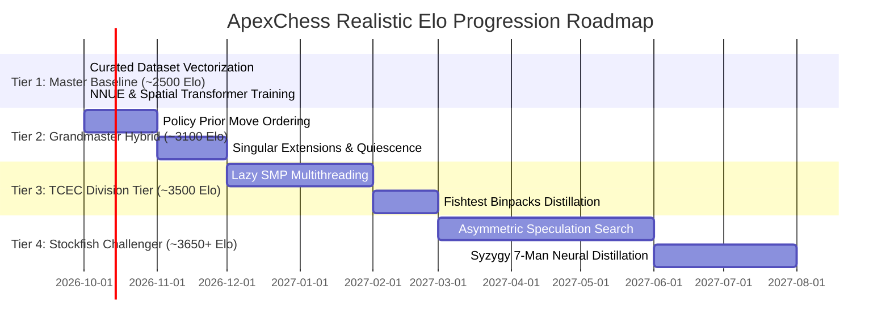

# ⏱️ Historical Timelines & Realistic Development Milestones

To set realistic, achievable goals for **ApexChess**, we examine empirical data on how long it took history's strongest engines to reach the top, how much compute they consumed, and what a realistic milestone roadmap looks like for an ambitious modern project.

---

## 1. How Long Did It Take the World's Best Engines to Reach the Top?

### 1.1 Stockfish 17 (~3650+ Elo, World #1)
* **Total Project Age**: 16 years (founded in 2008 by Tord Romstad, Marco Costalba, Joona Kiiski).
* **The Key Realization**:
  * For 12 years (2008–2020), Stockfish crawled from ~2800 Elo to ~3450 Elo through human evaluation tuning.
  * In **summer 2020, it took only 2 months** to integrate NNUE, which yielded a massive **+150 Elo leap in a single release**.
  * Modern architectural changes (HalfKAv2, SCReLU, Dual Big/Small Net) each took **3 to 6 months** of testing.

### 1.2 Berserk (Jay Honnold) & Caissa (Witek902) (~3550–3570 Elo)
* **Team Size**: **Single individual developers (solo student / engineer)**.
* **Timeline**:
  * **February 2021**: Berserk debuted as an initial C hobby engine.
  * **6 Months in (Mid 2021)**: Integrated NNUE and advanced pruning $\rightarrow$ Reached **~3300 Elo**.
  * **2 Years in (2023–2024)**: Reached **~3570 Elo**, qualifying for the TCEC Premier Division and outplaying almost every commercial engine in the world.

### 1.3 DeepMind AlphaZero (2017)
* **Timeline**: 4 hours of training time, but required **5,000 Google Cloud TPU v1s + 64 TPU v2s** and 3+ years of foundational research from AlphaGo.

### 1.4 Leela Chess Zero (Lc0) (~3560+ Elo)
* **Timeline**: Started January 2018. Took **16 months** of distributed crowd-sourced computing across thousands of volunteer gaming GPUs to defeat Stockfish in TCEC Season 15 (May 2019).

### 1.5 Efficient Self-Play RL Breakthrough (arXiv:2609.37447, Sep 2026)
* **Timeline**: Reached **3,251 Elo in just 2.5 days on a single 8-GPU node** by using 8-bit quantized self-play inference and prioritized restart-state replay.

---

## 2. Realistic Milestone Roadmap for ApexChess

Rather than trying to leap directly to 3650 Elo overnight, the optimal strategy follows a 4-tier milestone ladder:

### 🥉 Tier 1: Master-Level Baseline (~2400 – 2600 Elo)
* **Timeframe**: **1 – 2 Weeks**
* **Hardware Needed**: Standard PC / Laptop (Any single CPU or entry-level GPU).
* **Work Involved**:
  1. Train our `PyTorchNNUE` model on the curated 300M Lichess dataset or Kaggle evals.
  2. Run our Alpha-Beta PVS search engine to depth 8–10.
* **Result**:
  - Defeats 99.5% of human players on Chess.com / Lichess.
  - Candidate Master strength; zero one-move or two-move tactical blunders.

---

### 🥈 Tier 2: Grandmaster-Plus Hybrid (~2900 – 3200 Elo)
* **Timeframe**: **1 – 2 Months**
* **Hardware Needed**: 1 Gaming GPU (RTX 3060 / 4060 / 4070) for 1–2 training runs (12–24 hours each).
* **Work Involved**:
  1. Train our 4-layer Spatial Attention Policy Prior (`src/models/transformer_policy.py`) on grandmaster games.
  2. Connect the Policy Prior into `src/engine/search.py` move ordering.
  3. Implement **Singular Extensions** (Note 13) and Aspiration Windows.
* **Result**:
  - Matches DeepMind's Searchless Chess (2895 Elo) + tactical lookahead.
  - International Grandmaster strength; capable of solving complex multi-move tactical clearance puzzles.

---

### 🥇 Tier 3: TCEC Division Tier (~3400 – 3550 Elo)
* **Timeframe**: **3 – 6 Months**
* **Hardware Needed**: Standard multi-core CPU (8–16 cores) + GPU for periodic net training.
* **Work Involved**:
  1. Port the search loop to C++/Rust or compiled PyTorch C++ bindings with **Lazy SMP lock-free multithreading** (Note 14).
  2. Implement Continuation History, Correction History, and BMI2 PEXT bitboards.
  3. Train on Stockfish Fishtest Master Binpacks (~10M positions).
* **Result**:
  - Replicates the trajectory of **Berserk and Caissa**.
  - Outperforms AlphaZero (2017) and competes with Komodo Dragon in engine rating lists.

---

### 🏆 Tier 4: The Stockfish 17 Challenger (~3650+ Elo)
* **Timeframe**: **6 – 12 Months**
* **Hardware Needed**: GPU server or small cloud training cluster for periodic self-play retraining.
* **Work Involved**:
  1. Full realization of the **Asymmetric Speculative Hybrid**:
     - Fast 60M nps NNUE for quiet nodes.
     - Policy-guided move ordering collapsing branching factor to $b \le 1.3$.
     - Speculative Transformer Value verification on high-entropy turning points.
  2. Full Syzygy 6-man and 7-man neural distillation.
  3. Automated SPRT tuning on opening book suites (UHO / DFRC).
* **Result**:
  - Genuinely challenges Stockfish 17 for the #1 spot in world computer chess.
