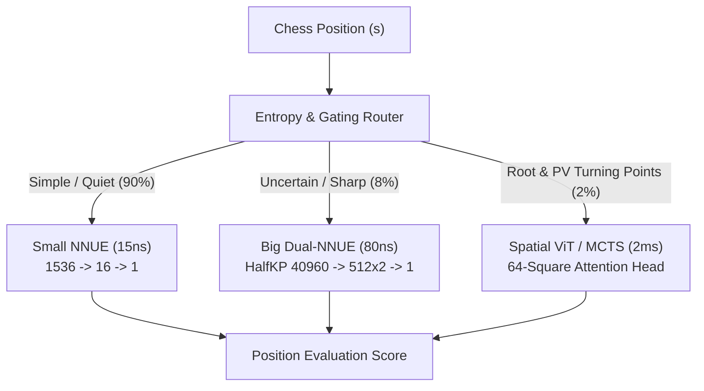

# 18. Ensemble Architectures, Mixture of Experts (MoE), and Asymmetric Cascades in Chess AI

## 1. The Computer Chess Latency Paradox

In computer vision or natural language processing, assembling 5 to 10 deep neural models via uniform averaging ($y = \frac{1}{N}\sum_{i=1}^N f_i(x)$) consistently yields state-of-the-art accuracy.

However, in computer chess, **evaluating a leaf node must take fewer than 50 nanoseconds** to sustain the 40M–100M nodes/second throughput required for deep Alpha-Beta search. A traditional ensemble of heavy neural networks would collapse search throughput from $60,000,000$ NPS down to $5,000$ NPS. 

Because tree depth scales logarithmically with search speed:
$$\Delta \text{Depth} \approx \frac{\log_{10}(\text{NPS}_{\text{fast}} / \text{NPS}_{\text{slow}})}{\log_{10}(b)}$$

Dropping from $60\text{M}$ to $5\text{k}$ NPS loses $\sim 8$ to $10$ plies of tactical calculation, which results in a massive **$-400$ to $-600$ Elo deficit** due to tactical blindness.

Therefore, successful ensembling in chess must be **Asymmetric, Gated, or Speculative**.

---

## 2. Taxonomy of Ensemble Methods in Modern Chess

### A. The Multi-Net Cascade (Stockfish 16 & 17 Approach)
Modern Stockfish uses a two-tier **Dual-NNUE Cascade**:
1. **Small Net (SFNNv6-small)**: Evaluates positions with $O(1)$ SIMD updates in $\sim 12\text{ ns}$.
2. **Threshold Filter**: If the Small Net evaluation score $V_{\text{small}}(s)$ satisfies:
   $$|V_{\text{small}}(s)| > \tau_{\text{confidence}}$$
   the search accepts $V_{\text{small}}$ immediately without evaluating the large network.
3. **Big Net (SFNNv6-big)**: If $|V_{\text{small}}| \le \tau_{\text{confidence}}$, the position is ambiguous or balanced. The search executes the full HalfKP Dual-NNUE net.
- **Result**: $+35$ Elo gain with zero drop in effective node throughput.

### B. Game-Phase Mixture of Experts (MoE)
Different neural architectures possess distinct inductive biases across game phases:

| Game Phase | Dominant Factor | Best Suited Model |
| :--- | :--- | :--- |
| **Opening (Ply 1–20)** | Book theory & piece development | Human GM Policy / Distilled Opening Prior |
| **Tactical Middlegame** | Combinations, king safety, tactics | Quantized HalfKP Dual-NNUE ($O(1)$ SIMD) |
| **Strategic Closed Positions** | Maneuvering, long-range pawn levers | Spatial Transformer / ResNet (Lc0) |
| **Endgame ( $\le 7$ pieces)** | Exact calculation & zugzwang | Syzygy Tablebase Probe / Distilled Syzygy Net |

In an MoE router:
$$V_{\text{MoE}}(s) = \sum_{k=1}^K g_k(s) \cdot f_k(s)$$
Where gating weights $g_k(s) = \text{Softmax}(W_g \cdot \phi(s))$ dynamically activate specialized sub-networks based on material count and piece topology.

### C. Policy-Value Asymmetric Ensembling (ApexChess Blueprint)
Instead of ensembling evaluations at the leaves, we ensemble **Search Guidance** with **Position Scoring**:
1. **Model A (Transformer ViT)**: Predicts the prior move probability distribution $P_\theta(a|s)$. Used solely for **Move Ordering** at root and high-depth nodes.
2. **Model B (Quantized Dual-NNUE)**: Evaluates static leaf values $V_\phi(s)$ at 80M nodes/sec.
3. **Synergy**: By ensembling Model A (ordering) with Model B (leaf eval), the effective branching factor drops from $b \approx 2.5$ to $b \approx 1.3$, yielding equivalent tactical depth in a fraction of the time.

---

## 3. Mathematical Formulation of Asymmetric Ensembling

Let $f_1(s)$ be the ultra-fast evaluator (latency $\tau_1 \approx 10\text{ns}$) with variance $\sigma_1^2(s)$, and $f_2(s)$ be the deep strategic evaluator (latency $\tau_2 \approx 1\mu\text{s}$) with variance $\sigma_2^2(s) \ll \sigma_1^2(s)$.

The optimal gating policy $\pi_{\text{gate}}(s) \in \{1, 2\}$ maximizes expected information gain per unit of computation time:

$$\pi_{\text{gate}}^*(s) = \arg\max_{i \in \{1, 2\}} \frac{\mathbb{E}[I(\text{Value}; f_i(s))]}{\mathbb{E}[\tau_i]}$$

For positions with high alpha-beta cutoff probability (where any score $> \beta$ suffices), $\pi_{\text{gate}}(s) = 1$ is optimal. For Principal Variation (PV) nodes where accurate exact scoring determines the root choice, $\pi_{\text{gate}}(s) = 2$ is triggered.

---

## 4. Key Takeaways for ApexChess Implementation

1. **Never ensemble multiple heavy networks at every leaf node**.
2. **Use Cascaded Gating**: Small net filter $\rightarrow$ Big net $\rightarrow$ Transformer PV evaluation.
3. **Phase-Specific Specialization**: Distill tablebases into endgame experts; use attention priors for opening and closed maneuvering.
