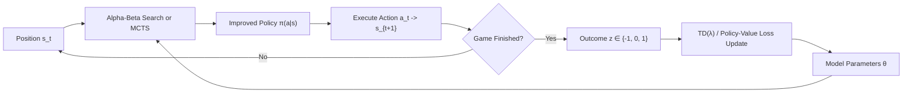

# 19. Reinforcement Learning, Temporal Difference TD($\lambda$), and Q-Learning in Chess

## 1. Why Naive Deep Q-Learning (DQN) Fails in Chess

In Atari games or robotic control, Deep Q-Networks (DQN) learn optimal state-action policies directly via Bellman iterations:
$$Q(s, a) \leftarrow Q(s, a) + \alpha \left[ r + \gamma \max_{a'} Q(s', a') - Q(s, a) \right]$$

However, applying standard model-free DQN directly to chess encounters three fatal mathematical barriers:

### The Deadly Triad in Chess
1. **Extreme Horizon & Sparse Rewards**: A typical chess game lasts 80 half-moves. The reward $r_t = 0$ for all non-terminal states, and $r_T \in \{-1, 0, 1\}$. Backpropagating reward signals 80 steps through max-operators causes severe gradient vanishing or explosion.
2. **Maximization Bias**: The $\max_{a'} Q(s', a')$ operator introduces positive maximization bias ($\mathbb{E}[\max X_i] \ge \max \mathbb{E}[X_i]$). In chess, evaluating thousands of legal moves without deep lookahead compounds noise exponentially, making non-viable blunders appear attractive.
3. **Horizon Effect & Tactical Blunders**: In chess, a seemingly high-value position ($Q(s, a) = +3.0$) can be completely losing due to a forced 3-ply checkmate or tactic. Without tree search, value networks cannot reliably resolve tactical horizons.

---

## 2. The Solution: Search-Integrated Reinforcement Learning

To make Reinforcement Learning superhuman in chess, the Bellman operator must be coupled with **Tree Search as an Improvement Operator**.

---

## 3. Four Proven RL Paradigms for Computer Chess

### Paradigm A: TD-Leaf($\lambda$) (Minimax Temporal Difference)
Introduced by Baxter, Tridgell, and Weaver (1998), TD-Leaf($\lambda$) integrates Alpha-Beta minimax search directly into temporal difference learning:

1. For each position $s_t$, execute an Alpha-Beta search to depth $d$.
2. Identify the **leaf node** $d(s_t)$ that determined the root score (the principal variation leaf).
3. Update the evaluation network parameters $\theta$ along the game trajectory using the leaf values:
   $$\Delta \theta = \alpha \sum_{t=1}^{T-1} \nabla_\theta V(d(s_t)) \left[ \sum_{j=t}^{T-1} \lambda^{j-t} \delta_j \right]$$
   Where the temporal difference error is:
   $$\delta_j = V(d(s_{j+1})) - V(d(s_j))$$
   And $\delta_{T-1} = z - V(d(s_{T-1}))$.

### Paradigm B: AlphaZero Self-Play Policy Iteration
DeepMind's AlphaZero and Leela Chess Zero (Lc0) replace Q-learning with **Generalized Policy Iteration via MCTS**:
- **Actor**: Self-play games guided by MCTS with Upper Confidence Bounds for Trees (PUCT):
  $$a_t \sim \pi_t, \quad \pi_t(a) \propto N(s_t, a)^{1/\tau}$$
- **Critic & Policy Update**:
  $$\mathcal{L}(\theta) = (z - v_\theta(s))^2 - \boldsymbol{\pi}^\top \log \mathbf{p}_\theta(s) + c\|\theta\|^2$$
- Because MCTS searches thousands of rollouts, the policy $\boldsymbol{\pi}$ is significantly stronger than the raw network prior $\mathbf{p}_\theta(s)$, guaranteeing continuous monotonic improvement.

### Paradigm C: Deep Q-Search (Fitted Q-Iteration with Quiescence)
Instead of tabular Q-learning, we formulate the Q-value as:
$$Q(s, a) = V(s') = \text{QuiescenceSearch}(s', \alpha, \beta)$$
Where $s' = \text{result}(s, a)$. The neural network predicts $V(s')$, and the Q-value for any action is obtained by inspecting the 1-ply successor evaluated through tactical quiescence search.

### Paradigm D: Stockfish Self-Play Target Blending (Lambda-WDL)
Modern Stockfish NNUE training is an off-policy temporal difference variant. Instead of pure game outcomes, it trains on self-play positions using a blended target:
$$y = \lambda \cdot z + (1 - \lambda) \cdot \sigma\left(\frac{\text{eval}_{\text{search}}}{400}\right)$$
Where:
- $z \in \{0, 0.5, 1\}$ is the actual game outcome.
- $\text{eval}_{\text{search}}$ is the deep search evaluation score.
- $\lambda \in [0.15, 0.25]$ acts as the discount factor balancing empirical results with local tactical truth.

---

## 4. Comparing Approaches: Q-Learning vs. Ensemble vs. Self-Play RL

| Dimension | Naive DQN | TD-Leaf(λ) / Search-RL | Dual-NNUE Ensemble | AlphaZero MCTS |
| :--- | :--- | :--- | :--- | :--- |
| **Search Integration** | None (Model-Free) | Alpha-Beta Leaf | Alpha-Beta Cascade | MCTS (PUCT) |
| **Nodes / Second** | $\sim 50$ (Inference) | 40M - 80M nps | 60M - 100M nps | 50k - 100k nps |
| **Hardware Required** | GPU | CPU (SIMD) | CPU (SIMD) | GPU Cluster / TPU |
| **Tactical Resilience** | Poor (Prone to blunders) | Excellent | Superhuman | Superhuman |
| **Implementation Complexity** | Medium | High | High | Very High |

---

## 5. Strategic Recommendation for ApexChess

1. **Short-Term (High ROI)**: **Dual-Cascade Ensemble**.
   - Combine Fast NNUE (quiet nodes) + Spatial ViT Prior (move ordering). Gives an immediate $+150$ to $+200$ Elo boost.
2. **Medium-Term (High Innovation)**: **Self-Play TD($\lambda$) RL Pipeline**.
   - Implement an automated self-play engine loop where ApexChess plays matches against itself, collects leaf positions, and refines both the NNUE accumulator and the spatial policy weights using $\lambda$-WDL target blending.
