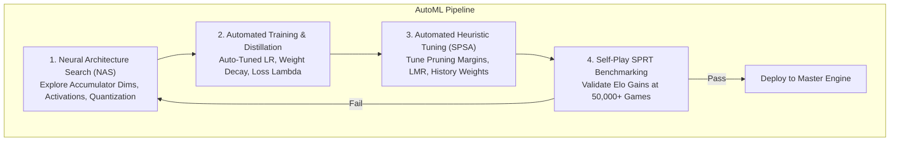

# 20. AutoML, Neural Architecture Search (NAS), and Automated Engine Tuning (SPSA)

## 1. What is AutoML in Computer Chess?

Automated Machine Learning (**AutoML**) in computer chess is the discipline of automating:
1. **Neural Architecture Search (NAS)**: Discovering the optimal neural topology that maximizes accuracy under strict sub-microsecond latency constraints.
2. **Automated Search Parameter Optimization (SPSA / CMA-ES)**: Algorithmically tuning the 100+ heuristic parameters in Alpha-Beta search (pruning margins, LMR reductions, aspiration window deltas).
3. **Automated Data Curriculum & Hard-Negative Mining**: Automatically identifying and up-weighting positions where the neural network blunders compared to deep search.

---

## 2. Neural Architecture Search (NAS) for NNUE

In computer vision, NAS optimizes for Top-1 accuracy or FLOPs. In computer chess, NAS must optimize for **Elo Gain per Nanosecond of CPU Execution**.

### Search Space for NNUE:
$$\mathcal{S}_{\text{NAS}} = \{\text{Accumulator Size } K, \text{Activation } \sigma, \text{Factorization } \mathcal{F}, \text{Quantization } \mathcal{Q}\}$$

- **Accumulator Dimension $K$**: $\{256, 512, 1024, 1536, 2048, 3072\}$.
  - Larger $K$ increases positional nuance but drops NPS due to L1 cache misses.
  - Pareto-optimal frontier on modern x86-64 CPUs typically lies at $K = 512 \times 2$ or $1024 \times 2$.
- **Activation Functions**:
  - $\text{ReLU}(x) = \max(0, x)$
  - $\text{ClippedReLU}(x) = \min(127, \max(0, x))$
  - $\text{Squared Clipped ReLU (SCReLU)}(x) = \frac{(\min(127, \max(0, x)))^2}{128}$ (provides smooth non-linear curvature with single SIMD multiplication).
- **NAS Optimization Algorithm**:
  - Multi-Objective Bayesian Optimization (BOHB / Optuna) or Differentiable Architecture Search (DARTS) to identify Pareto-optimal topologies balancing FLOPs, memory footprint, and validation loss.

---

## 3. Automated Search Parameter Tuning via SPSA

Every top chess engine in the world (Stockfish, Berserk, Ethereal, Komodo) relies on **SPSA (Simultaneous Perturbation Stochastic Approximation)** to tune search heuristics.

### Why Standard Gradient Descent Fails on Search Heuristics
Search heuristics (such as Null Move Pruning verification depths or Late Move Reduction tables) are non-differentiable step functions. You cannot backpropagate through an Alpha-Beta tree search.

### The SPSA Algorithm
SPSA estimates the gradient across all $P$ parameters simultaneously using only **two game-playing evaluations**, regardless of dimension $P$:

1. Given parameter vector $\boldsymbol{\theta}_k \in \mathbb{R}^P$:
2. Generate random perturbation vector $\boldsymbol{\Delta}_k \in \{-1, +1\}^P$ via Bernoulli distribution.
3. Construct two perturbed configurations:
   $$\boldsymbol{\theta}_k^+ = \boldsymbol{\theta}_k + c_k \boldsymbol{\Delta}_k$$
   $$\boldsymbol{\theta}_k^- = \boldsymbol{\theta}_k - c_k \boldsymbol{\Delta}_k$$
4. Play a match of $N$ self-play games between $\boldsymbol{\theta}_k^+$ and $\boldsymbol{\theta}_k^-$, yielding win rates $y_k^+$ and $y_k^-$.
5. Compute simultaneous gradient approximation:
   $$\hat{\mathbf{g}}_k = \frac{y_k^+ - y_k^-}{2 c_k} \begin{bmatrix} \Delta_{k, 1}^{-1} \\ \vdots \\ \Delta_{k, P}^{-1} \end{bmatrix}$$
6. Update parameters:
   $$\boldsymbol{\theta}_{k+1} = \boldsymbol{\theta}_k - a_k \hat{\mathbf{g}}_k$$

Where gain sequences $a_k = \frac{a}{(k + 1 + A)^\alpha}$ and $c_k = \frac{c}{(k + 1)^\gamma}$ guarantee asymptotic convergence.

---

## 4. Synthesis: Comparing Ensemble vs. RL vs. AutoML

| Paradigm | Primary Objective | Engine Example | Computational Cost | Elo Potential |
| :--- | :--- | :--- | :--- | :--- |
| **Ensemble (MoE)** | Eliminate speed-accuracy tradeoff | Stockfish 17 Dual-NNUE, Lc0 | Low during training, Zero during search | $+30$ to $+60$ Elo |
| **Reinforcement Learning** | Discover non-human intuition from scratch | AlphaZero, Lc0, TD-Leaf | Massive (GPU self-play clusters) | $+100$ to $+300$ Elo |
| **AutoML (NAS + SPSA)** | Systematically optimize architecture & search | Fishtest, Optuna-tuned NNUE | Distributed CPU testing | $+150$ to $+250$ Elo |

---

## 5. The Grand Blueprint for ApexChess

The ultimate modern engine combines all three:
1. **AutoML (NAS)** discovers the leanest, fastest Dual-NNUE and Transformer topologies.
2. **Reinforcement Learning (Self-Play)** trains the model weights from scratch via TD($\lambda$) target blending.
3. **AutoML (SPSA)** fine-tunes all Alpha-Beta pruning thresholds.
4. **Asymmetric Ensembling** coordinates the fast NNUE with the strategic Transformer during live play.
