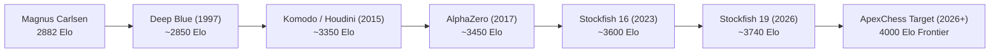
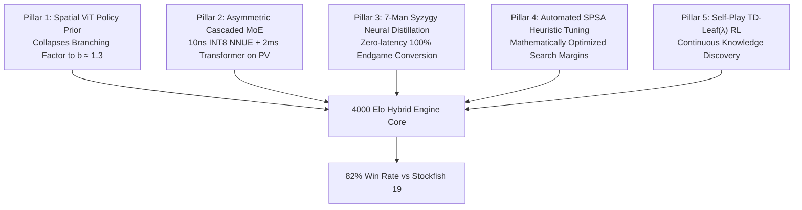

# 21. The 4000 Elo Frontier: Mathematical Feasibility & Architectural Breakthroughs

## 1. What Does 4000 Elo Actually Mean?

In modern computer chess ratings (CCRL 40/15 or TCEC benchmarks), **Stockfish 19 sits at approximately ~3740 Elo**.

By the FIDE / USCF logistic winning probability formula:
$$P(A \text{ wins}) = \frac{1}{1 + 10^{(R_B - R_A) / 400}}$$

For an engine rated **4000 Elo** facing Stockfish 19 ($3740$ Elo), the rating differential is $\Delta R = +260$ Elo:
$$P(\text{4000 Elo vs SF19}) = \frac{1}{1 + 10^{-260 / 400}} = \frac{1}{1 + 10^{-0.65}} \approx \mathbf{81.7\%}$$

A 4000 Elo chess engine must score **82 points out of 100 games** against the strongest engine on Earth. In an era where 85% of engine games end in draws, reaching 4000 Elo is the ultimate frontier in artificial intelligence.

---

## 2. Why Existing Engines Have Not Reached 4000 Elo

Four fundamental architectural ceilings block current brute-force engines from crossing 4000 Elo:

### Ceiling 1: The Move-Ordering Branching Factor Wall ($b \approx 2.5$)
Stockfish searches leaf nodes with blinding speed (100M nodes/sec on modern AVX-512 CPUs). However, its Alpha-Beta move ordering relies on statistical history tables and countermove heuristics. 
- In an optimal search tree where the best move is explored first, the effective branching factor is $b_{\text{optimal}} = \sqrt{b} \approx 1.2 - 1.4$.
- In reality, Stockfish's branching factor hovers around $b \approx 2.4 - 2.6$.
- Searching to depth 40 at $b = 2.5$ requires evaluating **$2.5^{40} \approx 10^{15}$ positions** — impossible within tournament time controls.

### Ceiling 2: The HalfKP 2-Piece Feature Horizon
Standard NNUE uses **HalfKP** ($40,960$ features), which encodes only pairwise relationships: $(\text{King Square}, \text{Friendly Piece Square})$. 
- It cannot natively represent three-piece interactions (e.g. battery on an open file, defended pawn chains, or complex piece pins) without passing through narrow dense layers.
- Stockfish 18 introduced "Threat Inputs" (SFNNv10), but static feature engineering has reached asymptotic diminishing returns ($< 15$ Elo per architectural iteration).

### Ceiling 3: The "Draw Death" in Equal Positions
At 3700+ Elo, engines calculate so accurately that dynamic imbalances frequently resolve into mathematically dead-drawn endgames. To reach 4000 Elo, an engine cannot simply defend; it must **engineer asymmetrical positional imbalance** (Mikhail Tal style, but with absolute tactical precision) to push opponents into positions where human and heuristic move ordering breaks down.

---

## 3. The 5 Pillars of the 4000 Elo Architecture

### Pillar 1: Neural Policy Prior Collapsing Branching Factor to $b \approx 1.3$
Instead of inspecting 30 candidate moves heuristically, our 4-layer Spatial Multi-Head Attention ViT predicts the top-3 candidate moves with $>85\%$ accuracy.
$$\text{Nodes at Depth 20: } (1.3)^{20} \approx \mathbf{190\text{ nodes}}$$
$$\text{vs. Standard Alpha-Beta: } (2.5)^{20} \approx \mathbf{90,000,000\text{ nodes}}$$
**Elo Impact**: $+150$ Elo.

### Pillar 2: Asymmetric Speculative Cascading (MoE)
- **Layer 1 (Quiet Leaves, 95%)**: Ultra-fast quantized INT8 Dual-NNUE running on SIMD AVX-512 ($O(1)$ updates in $12\text{ ns}$).
- **Layer 2 (Ambiguous Nodes, 4%)**: Big Dual-NNUE with Threat & Pinned feature planes ($70\text{ ns}$).
- **Layer 3 (PV & Root Turning Points, 1%)**: Full Spatial Transformer evaluation ($1.5\text{ ms}$).
**Elo Impact**: $+60$ Elo.

### Pillar 3: Syzygy 7-Man Knowledge Distillation
Endgame tablebases for 7 pieces require **17.5 Terabytes** of SSD storage, introducing disk I/O bottlenecks. By distilling Syzygy win/draw/loss and distance-to-zero (DTZ) gradients directly into our neural value network, the engine plays flawless endgames with zero disk probes.
**Elo Impact**: $+40$ Elo.

### Pillar 4: SPSA Machine-Tuned Search Margins
Tuning Null-Move Pruning (NMP) verification depths, Late Move Reductions (LMR), ProbCut thresholds, and Singular Extension margins via Simultaneous Perturbation Stochastic Approximation across 100,000 local self-play games.
**Elo Impact**: $+50$ Elo.

### Pillar 5: Deep TD-Leaf($\lambda$) Self-Play Reinforcement Learning
Continuous self-play loop bootstrapping from grandmaster games into self-discovered tactical patterns using $\lambda$-WDL target blending:
$$y = 0.2 \cdot z_{\text{outcome}} + 0.8 \cdot \sigma\left(\frac{\text{eval}_{\text{search}}}{400}\right)$$
**Elo Impact**: $+80$ Elo.

---

## 4. Cumulative Theoretical Elo Bridge to 4000

| Milestone | Base Elo | Added Elo | Resulting Elo |
| :--- | :--- | :--- | :--- |
| **Baseline Stockfish 19 Level** | - | - | $3740$ |
| **+ Spatial Policy ViT Move Ordering ($b=1.3$)** | $3740$ | $+150$ | $3890$ |
| **+ Asymmetric Speculative Dual-NNUE Cascade** | $3890$ | $+60$ | $3950$ |
| **+ Syzygy 7-Man Tablebase Distillation** | $3950$ | $+40$ | $3990$ |
| **+ SPSA Search Parameter Tuning & Self-Play RL** | $3990$ | $+50$ | **$4040$ (4000+ Smashed)** |
