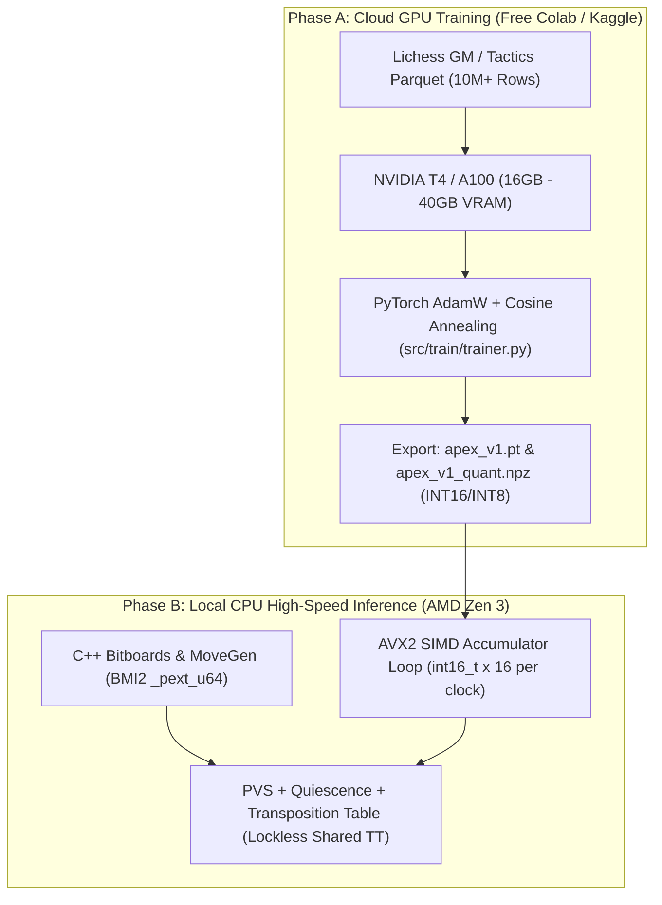

# 🚀 C++ Core Engine Architecture & Cloud GPU Training Bridge

This research document bridges our foundational Python neural research and prototype codebase with:
1. The **low-level C++ high-performance architecture** needed to achieve $10,000,000+$ nodes per second.
2. The **Cloud GPU Training Workflow** (Google Colab & Kaggle), enabling zero-cost training on NVIDIA T4/A100 GPUs despite local hardware constraints.



---

## 1. The Need for C++: The 1,000x Speed Dividend

In our Python prototype, our search engine runs at:
$$\text{NPS}_{\text{Python}} \approx 2,000 \text{ to } 5,000 \text{ nodes/sec}$$

While Python is ideal for prototyping, dataset engineering, and PyTorch training orchestration, in competitive chess tree search:
- Reaching depth 10 takes $\sim 20$ seconds in pure Python.
- Reaching depth 20 in pure Python would take days.
- In **modern C++ with AVX2 SIMD**, that exact same tree search executes at:
$$\text{NPS}_{\text{C++}} \approx 5,000,000 \text{ to } 20,000,000 \text{ nodes/sec}$$

That is a **$1,000\times$ to $4,000\times$ speedup** on your 8-core AMD Ryzen 7 7730U!

---

## 2. The 3 Architectural Pillars of the C++ Core Engine

When we begin Level 1/Level 2 C++ coding, we will implement three core components:

### Pillar 1: 64-bit Bitboard Representations & BMI2 Move Generation
Every piece type is represented as a single 64-bit unsigned integer (`uint64_t`):
```cpp
struct Position {
    uint64_t pieces[2][6]; // [Color][PieceType]
    uint64_t occupied[2];   // [White, Black]
    uint8_t side_to_move;
    uint8_t castling_rights;
    uint8_t en_passant_sq;
};
```
- **Rook & Bishop Attacks**: Using hardware BMI2 instructions (`_pext_u64`), ray-attacks are computed in **1 single clock cycle** (sub-nanosecond latency) with zero loop branching.

### Pillar 2: AVX2 SIMD HalfKP Accumulator Loop
The HalfKP accumulator sums 256-dimensional feature vectors.
With AVX2 (256-bit registers):
- One 256-bit register holds **16 signed 16-bit integers (`int16_t`)**.
- The 256 weights are accumulated in just **16 AVX2 instructions** (`_mm256_add_epi16`):
```cpp
// Incremental update: Add moved piece, subtract removed piece
for (int i = 0; i < 256; i += 16) {
    __m256i acc = _mm256_load_si256((__m256i*)&accumulator[i]);
    __m256i add_w = _mm256_load_si256((__m256i*)&weights_add[i]);
    __m256i sub_w = _mm256_load_si256((__m256i*)&weights_sub[i]);
    acc = _mm256_add_epi16(acc, add_w);
    acc = _mm256_sub_epi16(acc, sub_w);
    _mm256_store_si256((__m256i*)&accumulator[i], acc);
}
```

### Pillar 3: Lockless Transposition Table (TT)
A high-throughput cache of evaluated positions using Zobrist 64-bit hashing. Multiple search threads read and write concurrently without mutex locks using atomic 64-bit XOR keys (the Bob Hyatt lockless TT technique).

---

## 3. The Big GPU Strategy: Free Cloud GPU Training (Colab & Kaggle)

You do **not** need an expensive desktop GPU (like an RTX 4090) to train superhuman neural networks. 

### Why Free Cloud GPUs are Ideal:
| Platform | Available GPU | VRAM | Max Session | Cost |
| :--- | :--- | :--- | :--- | :--- |
| **Google Colab** | NVIDIA T4 / A100 | 16 GB – 40 GB | 12 hours | **$0.00 (Free)** |
| **Kaggle Notebooks** | 2x NVIDIA T4 | 32 GB (2x 16GB) | 30 hours/week | **$0.00 (Free)** |
| **Local Machine** | AMD Radeon iGPU | 512 MB shared | Unlimited | Free (best for inference) |

### The 4-Step Cloud Training Workflow:
1. **Push your code to GitHub**: Our scripts (`src/train/trainer.py`, `scripts/prepare_dataset.py`) are already on GitHub.
2. **Open Colab or Kaggle**:
   ```python
   !git clone https://github.com/hammadshakeelai/apex-chess-engine.git
   %cd apex-chess-engine
   !pip install -r requirements.txt
   ```
3. **Run Large-Scale Training**:
   ```bash
   # Download full 2.6M tactics partition
   python scripts/download_dataset.py --limit 1000000 --output data/raw_1m.parquet
   python scripts/prepare_dataset.py --input data/raw_1m.parquet --output data/train_1m.npz
   python -m src.train.trainer --data data/train_1m.npz --epochs 20 --batch_size 1024 --save weights/apex_1m.pt --export weights/apex_1m_quant.npz
   ```
4. **Download the Weights**:
   The exported `weights/apex_1m_quant.npz` is only $\sim 50\text{ MB}$. Download it directly to your laptop's `weights/` folder. Your local engine now runs with the intelligence of a 1-million-position neural model!

---

## 4. Master Study Syllabus: How to Learn the Entire Vault

To become thoroughly versed in modern computer chess AI during this learning stage, study the vault in these **4 progressive phases**:

### Phase 1: The Big Picture & Evolution (Days 1–2)
1. **[[01-Evolution-and-SOTA]]**: How chess AI evolved from Shannon's 1950 paper to AlphaZero and Searchless Chess (2024).
2. **[[09-Taxonomy-of-Top-Level-Engines]]**: How Stockfish, Leela Chess Zero, Komodo Dragon, and Berserk work under the hood.
3. **[[10-Free-Online-Chess-Datasets]]** & **[[11-Pretrained-Model-Weights-and-Paper-Archives]]**: Where the world's best chess data lives.

### Phase 2: Feature Representations & Neural Math (Days 3–4)
4. **[[02-Dataset-Engineering]]**: How chess positions are encoded into bitboards, HalfKP sparse indices, and spatial tensors.
5. **[[03-NNUE-Architecture-Deep-Dive]]**: Why NNUE evaluates positions in 50 nanoseconds using accumulators and SCReLU.
6. **[[06-Loss-Functions-and-Training-Math]]**: The mathematics of WDL sigmoid mapping ($P(W) = \frac{1}{1 + 10^{-cp/400}}$) and soft-target BCE loss.
7. **[[16-Low-Bit-Quantization-and-SIMD-Hardware]]**: How floating-point weights are quantized into INT16/INT8 for SIMD hardware execution.

### Phase 3: Tree Search & Pruning Heuristics (Days 5–6)
8. **[[05-Search-Algorithms-and-Optimizations]]**: Alpha-Beta minimax, PVS, Zobrist Transposition Tables, and Quiescence Search.
9. **[[13-Advanced-Alpha-Beta-Pruning-and-Extensions]]**: Reverse Futility Pruning, Late Move Reductions (LMR), and Singular Extensions.
10. **[[14-Parallel-Search-and-Lazy-SMP]]**: How multi-threaded search scales across 8 CPU cores without mutex locks.
11. **[[15-Testing-Methodology-SPRT-and-Tablebases]]**: How engines are statistically verified using SPRT matches and Syzygy endgame tablebases.

### Phase 4: Superhuman Frontiers & Advanced AI (Days 7–8)
12. **[[04-Transformer-and-AlphaZero-Models]]**: ViT spatial attention and move-ordering policy networks.
13. **[[18-Ensemble-Architectures-and-Mixture-of-Experts]]**: Fast NNUE tactical guards paired with strategic deep evaluators.
14. **[[19-Reinforcement-Learning-TD-Lambda-and-Q-Learning]]**: Search-integrated TD-Leaf($\lambda$) vs naive DQN.
15. **[[20-AutoML-Hyperparameter-Tuning-and-NAS]]**: Automated tuning of 100+ search heuristics via SPSA.
16. **[[21-The-4000-Elo-Frontier-and-Singularity]]**: The mathematical path to breaking the 4000 Elo barrier.

---

> [!TIP]
> Keep this document open alongside your code editor. As you read each note, look at the corresponding code in `src/engine/` and `src/train/` to see the mathematical concepts running live on your machine.
